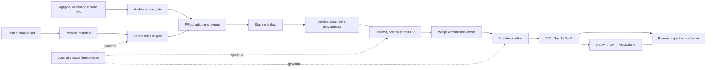
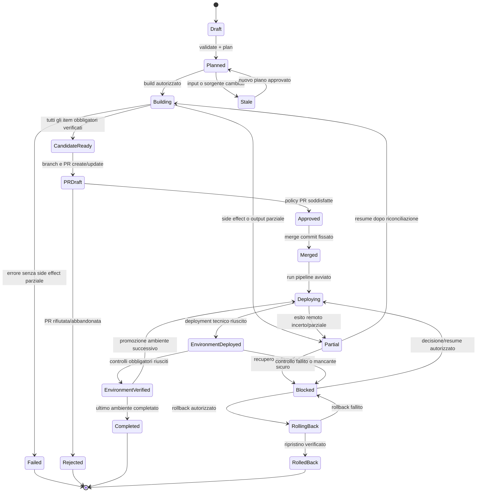

# PRbot e Agrippa: specifica di readiness per l'automazione dei rilasci

> **Stato del documento:** proposta implementativa da discutere con Aron e con gli owner delle pipeline
> **Data:** 2026-07-13
> **Destinatari:** Aron Winkler, team di sviluppo, reviewer, owner CI/CD e coding agent
> **Repository analizzato:** [`waron97/prbot`](https://github.com/waron97/prbot)
> **Baseline del codice:** branch `master`, commit [`175b6c2cff16e3a5eb7ba9f7a0a29ccae9ef7230`](https://github.com/waron97/prbot/commit/175b6c2cff16e3a5eb7ba9f7a0a29ccae9ef7230) del 2026-06-30
> **Pacchetto dichiarato:** `@waron97/prbot` `3.2.1`
> **Aggiornamento 2026-07-17:** integrato lo sviluppo LRP di `master` — commit [`731889f`](https://github.com/waron97/prbot/commit/731889f934f71b690dc53431ea7637e673941cf4) del 2026-07-16, versione `3.3.0` pubblicata su npm (vedi §3.2)

## Come leggere questo documento

Il documento ha due livelli, costruiti sulla stessa fonte normativa.

- Le parti **I** e **II** raccontano a una persona perché servono gli interventi, quale problema risolvono e come cambierebbe il lavoro quotidiano.
- La parte **III** contiene requisiti numerati, pensati per essere trasformati in issue, pull request o incarichi per un coding agent.
- Le **appendici** fissano i contratti proposti: comandi, manifest, output JSON, stati e verifiche.

La narrazione non introduce requisiti autonomi. Quando descrive uno sviluppo, richiama l'identificativo della parte implementativa. In caso di divergenza prevale il requisito numerato.

## In breve per Aron

- Non viene proposta una riscrittura: gli export, i checksum, l'editing Agrippa e le integrazioni esistenti sono la base da conservare.
- Il punto d'ingresso naturale è l'intervento che hai già annunciato nella call — comandi indipendenti dai puntamenti live e una modalità offline sicura per gli agenti: la specifica lo formalizza in `REL-CFG-002`.
- Nessuna pretesa di transazioni ACID sui sistemi target: dove l'atomicità non esiste valgono journal, rilevazione del parziale e riconciliazione (è già un non-obiettivo dichiarato, §7).
- La contaminazione da ambiente condiviso non si «ripulisce» mai a mano: si rileva, si attribuisce e si governa con una policy — `report` (accetta e segnala, predefinita) oppure `reject` dove serve.
- `release plan` non pretende di simulare l'output degli export: valida identità, revisioni e prerequisiti in sola lettura; il contenuto si verifica dopo l'apply.
- Il primo risultato utile non è il deployment automatico, ma una CLI affidabile e testata che non possa confondere errore e successo.
- Il secondo risultato è un candidato costruito da manifest, in isolamento, con revisione sorgente, exact-diff e provenienza.
- Journal e idempotenza vengono prima dell'orchestrazione di PR e pipeline, perché rendono recuperabili i side effect già esistenti.
- Il deployment resta nella pipeline: PRbot aggiunge un adapter per avviarla e osservarla quando gli owner forniranno il contratto.
- Agrippa resta focalizzato su authoring e sincronizzazione dev, ma conflitti e push parziali diventano tecnicamente bloccanti o recuperabili.
- La parte III contiene 50 requisiti trasformabili in issue; l'appendice F propone 18 pull request ordinate per dipendenza, e i lotti 1–6 producono valore quotidiano anche da soli, prima di qualunque manifest.
- Le domande che Aron non può risolvere da solo sono isolate nell'appendice G e assegnate agli owner suggeriti.

---

# Parte I — Mandato, perimetro e criteri di successo

## 1. Scopo

Questo documento descrive ciò che è necessario implementare in PRbot e Agrippa affinché possano essere usati in modo affidabile all'interno del metodo di sviluppo con coding agent, estendendolo oltre la produzione delle modifiche fino alla preparazione, promozione e verifica del rilascio.

L'obiettivo non è eliminare il giudizio umano. È automatizzare le operazioni deterministiche, rendere visibili le decisioni e impedire che un errore tecnico, una modifica concorrente o un artefatto dimenticato vengano scambiati per un rilascio valido.

Il risultato atteso è un flusso in cui:

1. ogni task dichiara gli artefatti che modifica;
2. una release aggrega esplicitamente i task e le relative dipendenze;
3. PRbot costruisce un candidato riproducibile e attribuibile;
4. la pull request contiene soltanto gli elementi dichiarati;
5. una pipeline distribuisce lo stesso commit approvato;
6. per ogni ambiente vengono conservati esito, verifiche e approvazioni;
7. un'esecuzione interrotta è riprendibile e un rilascio fallito ha una strategia di ripristino.

## 2. Pubblico e utilizzi previsti

Il documento deve servire contemporaneamente a quattro lettori.

| Lettore                   | Cosa deve ricavarne                                                                                                  |
| ------------------------- | -------------------------------------------------------------------------------------------------------------------- |
| Aron / maintainer         | Perché serve ogni sviluppo, da dove iniziare, quali file sono probabilmente coinvolti e come verificare la consegna. |
| Team e reviewer           | Quale rischio viene ridotto e quali comportamenti diventeranno obbligatori.                                          |
| Owner CI/CD e piattaforma | Quali contratti esterni devono essere forniti: pipeline, ambienti, credenziali tecniche, stato e rollback.           |
| Coding agent              | Requisiti non ambigui, dipendenze, limiti di autonomia, criteri di accettazione e comandi di verifica.               |

## 3. Fonti, attendibilità e limiti

### 3.1 Fonti utilizzate

- Repository pubblico [`waron97/prbot`](https://github.com/waron97/prbot), ispezionato al commit indicato nell'intestazione.
- File applicativi sotto [`src/`](https://github.com/waron97/prbot/tree/master/src), inclusi i due entrypoint `prbot` e `agrippa`.
- [`README.md`](https://github.com/waron97/prbot/blob/master/README.md) e [`agrippa-pb.md`](https://github.com/waron97/prbot/blob/master/agrippa-pb.md).
- Note della call «Gestione rilasci con AI» del 2026-07-13 fornite da Vincenzo; la trascrizione è automatica e può contenere errori.
- Controlli locali eseguiti sul clone: installazione, test script, ESLint, Prettier, audit delle dipendenze, inventario Git e packaging dry-run.

### 3.2 Scostamento tra codice, pacchetto e call

**Fatto verificato.** La baseline pubblica è precedente di tredici giorni alla call. Non è quindi dimostrato che coincida con il working tree usato nella dimostrazione.

**Fatto verificato.** Il pacchetto npm `3.2.1` è stato pubblicato il 2026-06-22. `master` contiene commit successivi ma conserva la stessa versione nel `package.json`. Non risultano tag Git e GitHub non espone release pubblicate. Installare `3.2.1` da npm e creare un pacchetto da `master` non produce lo stesso contenuto.

**Conseguenza.** Prima di implementare modifiche sostanziali va confermato con Aron quale sorgente sia autorevole. I requisiti di tracciabilità restano validi indipendentemente dalla risposta.

**Aggiornamento del 2026-07-17.** `master` è avanzato a [`731889f`](https://github.com/waron97/prbot/commit/731889f934f71b690dc53431ea7637e673941cf4) (2026-07-16): supporto Agrippa per i long running (clone/pull/push per nome, editing `pb *`, deploy come passo separato), versione `3.3.0` pubblicata su npm lo stesso giorno, ancora nessun tag Git. La nota di lavoro inclusa nel repository (`ai_tasks/2026-07-16-lrp-clone/`) documenta esiti, verifiche sul campo e limiti aperti. Le parti LRP e Agrippa di questo documento sono aggiornate a quel commit; il resto dell'analisi resta riferito a `175b6c2`.

### 3.3 Cosa non è stato verificato

Non sono stati eseguiti export o push verso sistemi Sorgenia, né sono state interrogate pipeline Azure DevOps reali. Restano quindi dipendenze esterne:

- endpoint, permessi e contratti runtime effettivi;
- supporto di ETag, revisioni o scritture condizionali;
- modalità di avvio, monitoraggio e rollback delle pipeline;
- mapping autorevole degli ambienti;
- collaudi minimi richiesti per ciascun tipo di artefatto;
- identità autorizzate ad approvare publish, merge, promozione e rollback.

Questi elementi non devono essere inventati dal maintainer o da un coding agent. Sono marcati nel documento come **dipendenza esterna**.

## 4. Lessico di attendibilità

Il documento usa le seguenti etichette.

| Etichetta                 | Significato                                                                                                    |
| ------------------------- | -------------------------------------------------------------------------------------------------------------- |
| **Fatto verificato**      | Riscontrato nel repository, tramite un comando riproducibile o nella configurazione pubblicata.                |
| **Osservazione del team** | Dichiarato durante la call; autorevole sul processo percepito, da confermare quando riguarda dettagli tecnici. |
| **Deduzione**             | Conseguenza ragionevole della lettura statica, non ancora provata sul runtime.                                 |
| **Decisione proposta**    | Soluzione raccomandata in questo documento, ancora discutibile.                                                |
| **Requisito**             | Comportamento richiesto per raggiungere la readiness definita qui.                                             |
| **Dipendenza esterna**    | Informazione o capacità che deve essere fornita da un altro owner.                                             |

## 5. Responsabilità target

### 5.1 Agrippa

Agrippa resta lo strumento per:

- portare localmente phase, MFA, Process Builder e, dalla `3.3.0`, long running process (identità per nome);
- rendere gli oggetti modificabili da persone e coding agent;
- produrre diff semantici;
- rilevare divergenze tra stato locale e remoto;
- sincronizzare verso l'ambiente di sviluppo con un'azione umana autorizzata;
- conservare metadati e backup necessari al recupero.

Agrippa non decide cosa appartiene a una release e non promuove direttamente artefatti negli ambienti successivi.

### 5.2 PRbot

PRbot diventa lo strumento per:

- validare un change-set o release manifest;
- produrre un piano senza side effect;
- eseguire export non interattivi e verificabili;
- costruire un candidato isolato;
- controllare che il candidato contenga solo ciò che è stato dichiarato;
- creare o aggiornare branch, changelog, Trident e pull request in modo idempotente;
- registrare stato, provenienza ed evidenze;
- invocare e osservare la pipeline attraverso un adapter, quando il relativo contratto sarà disponibile.

PRbot non replica la logica di deployment della pipeline e non decide autonomamente approvazioni funzionali.

### 5.3 Pipeline di deployment

La pipeline resta responsabile di:

- distribuire un commit o artefatto immutabile;
- applicare il mapping e l'ordine degli ambienti;
- restituire un identificativo di esecuzione e uno stato machine-readable;
- eseguire o richiamare i controlli tecnici disponibili;
- applicare il rollback supportato dalla piattaforma;
- conservare i log operativi secondo le policy aziendali.

## 6. Definizione operativa di “pronto e affidabile”

PRbot e Agrippa potranno essere dichiarati pronti per il metodo soltanto quando tutte le condizioni seguenti saranno vere.

1. **Correttezza osservabile:** exit code `0` significa che tutte le operazioni obbligatorie sono riuscite.
2. **Determinismo:** ogni percorso automatico è eseguibile senza prompt e usa identificativi stabili.
3. **Riproducibilità:** versione, commit e digest degli strumenti e degli input sono registrati.
4. **Attribuzione:** ogni artefatto è collegato a task, owner, ambiente sorgente e revisione osservata.
5. **Consistenza:** una modifica concorrente o un input cambiato dopo il piano blocca l'esecuzione.
6. **Idempotenza:** ripetere o riprendere un comando non duplica branch, PR, link Trident o changelog.
7. **Recuperabilità:** ogni side effect ha uno stato persistente e una strategia di resume, restore o compensazione.
8. **Sicurezza:** nessun segreto è versionato o esposto nei log; le identità hanno privilegi minimi.
9. **Verificabilità:** ogni requisito obbligatorio è coperto da test automatico o da un controllo runtime dichiarato.
10. **Immutabilità della promozione:** gli ambienti successivi ricevono il commit approvato, non un nuovo export.
11. **Evidenza per ambiente:** deployment, controllo tecnico, collaudo e approvazione hanno stato e riferimenti persistenti.
12. **Validazione sul campo:** sono completati almeno due rilasci pilota supervisionati, una prova di interruzione/ripresa e una prova di rollback.

Il termine “100%” in questo documento indica il soddisfacimento di queste condizioni e la chiusura di tutti i requisiti bloccanti; non indica l'assenza matematica di bug futuri.

## 7. Non-obiettivi

Non sono richiesti per dichiarare pronti i due strumenti:

- riscrivere PRbot o Agrippa in un altro linguaggio;
- sostituire Azure DevOps o il sistema CI/CD esistente;
- automatizzare immediatamente tutti i test end-to-end via browser;
- eliminare le approvazioni umane;
- dedurre automaticamente il 100% delle dipendenze di dominio, incluse le eccezioni cross-BBP;
- costruire una dashboard dedicata quando report JSON e link ai sistemi esistenti sono sufficienti;
- rendere atomiche operazioni che le API remote non possono rendere atomiche: in quel caso sono obbligatori journal, rilevazione del parziale e recupero sicuro.

---

# Parte II — Il percorso verso un rilascio affidabile

## 8. Dove siamo oggi

### 8.1 Il problema raccontato dal team

Dalla call emergono due difficoltà principali.

La prima è la **completezza del pacchetto**. Un processo può dipendere da codice Odoo, workflow XML, Process Builder, LRP Symphony, Imperex, email template e componenti condivisi. Una parte delle dipendenze è ricavabile da strutture come `allowed_processes`; altre, soprattutto le eccezioni e i processi condivisi, richiedono conoscenza esplicita. Dimenticare un elemento è una delle cause riportate per i problemi che emergono in Test1, preUAT o UAT.

La seconda è la **consistenza degli ambienti**. Test2 è anche ambiente condiviso di sviluppo. Alcuni elementi sono già presenti lì e vengono bypassati dalla pipeline, mentre Test1 riceve un rilascio più completo. Un export eseguito al termine del lavoro fotografa lo stato corrente dell'ambiente, che può includere cambiamenti di altri task. Durante la dimostrazione è stato osservato che un export sembrava contenere anche modifiche reali non necessariamente appartenenti al task mostrato.

Dopo merge e deployment, i controlli funzionali sono descritti come prevalentemente manuali e non sempre sistematici. I problemi possono quindi emergere vicino a preUAT o UAT per pezzi mancanti, test insufficienti o regressioni introdotte dopo il test precedente.

### 8.2 Cosa fa già PRbot

PRbot riduce molte operazioni manuali:

- esporta workflow, Process Builder, LRP, Imperex ed email template;
- scrive i file nelle directory attese del repository addons;
- crea commit e incrementi di versione;
- costruisce changelog;
- crea branch e draft PR su Azure DevOps;
- collega task Trident e riferimenti Jira;
- raggruppa export in routine configurabili.

Questa è una base preziosa perché concentra conoscenza di dominio e sostituisce navigazioni manuali nelle UI.

### 8.3 Cosa fa già Agrippa

Agrippa porta phase, MFA e Process Builder su filesystem e li rende più accessibili a un coding agent. Per i Process Builder scompone il payload in struttura, script, pagine e manifest, quindi lo ricompone per il push. Usa checksum semantici, classifica `fast-forward` e `conflict`, produce diff e conserva backup.

Dalla `3.3.0` gestisce con lo stesso motore anche i long running: clone per nome (`--lrp --name`), scomposizione identica ai PB (senza pagine), push con ri-risoluzione dell'id per nome e deploy sull'ambiente sorgente come passo separato ed esplicito.

La guida inclusa nel repository stabilisce inoltre un confine prudente: il coding agent può modificare file e usare comandi locali, mentre clone, pull, push, publish e riallineamento grafico restano azioni umane salvo autorizzazione esplicita.

### 8.4 Dove terminano entrambi

Nel repository non è presente un percorso che:

- costruisca una release a partire da un elenco versionato di task e artefatti;
- dimostri che l'export appartiene soltanto al task;
- promuova lo stesso commit attraverso gli ambienti;
- osservi l'esito della pipeline;
- registri collaudi e approvazioni per ambiente;
- riprenda in sicurezza una sequenza interrotta;
- esegua un rollback coordinato.

PRbot arriva alla preparazione della PR. Agrippa sincronizza con l'ambiente di sviluppo. Il tratto successivo deve essere aggiunto senza confondere le loro responsabilità.

## 9. Perché l'automazione attuale non è ancora sicura

### 9.1 Un errore può sembrare un successo

`--silent` è implementato come soppressione dell'output e degli errori. La routine intercetta un errore, stampa `Failed` e passa allo step successivo senza produrre un fallimento aggregato. Un agente o una pipeline potrebbero quindi aprire una PR incompleta credendo che la procedura sia riuscita. Questo viene risolto da `REL-CLI-001`, `REL-CLI-002` e `REL-RUN-001`.

### 9.2 Le selezioni interattive non sono una specifica

Process Builder, LRP e Imperex richiedono ricerche fuzzy. La routine non può trasmettere tutti gli identificativi necessari. Due persone possono quindi scegliere oggetti diversi pur partendo dalla stessa descrizione. Per un agente, una sequenza di prompt non è riproducibile. Questo viene risolto da `REL-CLI-003` e `REL-MAN-001`.

### 9.3 L'ambiente condiviso può contaminare l'export

Gli export fotografano lo stato corrente della sorgente. Senza revisione attesa, checksum e controllo dei file risultanti non è possibile dimostrare che ogni differenza appartenga alla release. La risposta non è ripulire a mano l'export — il contenuto esportato resta fedele alla sorgente — ma rilevare, attribuire e decidere per policy se accettare e segnalare oppure bloccare. Questo viene reso governabile da `REL-PLAN-001`, `REL-CON-001`, `REL-CAND-001` e `REL-CAND-002`.

### 9.4 Il rilevamento del conflitto è consultivo

Agrippa riconosce le divergenze, ma un elemento in conflitto resta selezionabile e viene preselezionato insieme agli altri. Tra la lettura e la scrittura esiste inoltre una finestra nella quale il remoto può cambiare. Questo viene risolto da `AGR-CON-001` e `REL-CON-002`.

### 9.5 Una sequenza può restare completata a metà

`autopr` crea branch, push, PR, collegamenti Trident e changelog in momenti diversi. Il push di un Process Builder aggiorna pagine e wizard con chiamate separate. Se uno step intermedio fallisce, il sistema non conserva uno stato sufficiente per riprendere in modo certo. I backup locali non sono un orchestratore di rollback. Questo viene risolto da `REL-RUN-001`, `REL-RUN-002`, `REL-PR-001`, `AGR-PB-001` e `REL-ROLL-001`.

### 9.6 Alcuni adapter dipendono da contratti fragili

Il polling Process Builder non ha un timeout complessivo e associa il job usando GUID, data corretta con un offset fisso e gli ultimi sette risultati. LRP estrae XML e filename da una risposta di UI tramite espressioni regolari. Imperex scarta il manifest e usa il basename degli allegati. Questi percorsi possono essere utili, ma devono dichiarare e validare la propria affidabilità. Se non esiste un'API stabile, l'adapter deve fallire in modo controllato e avere test contrattuali. Vedere `REL-ADP-PB-001`, `REL-ADP-LRP-001` e `REL-ADP-IMP-001`.

### 9.7 Distribuzione e qualità non sono riproducibili

Sul commit analizzato non esiste una suite di test; `npm test` fallisce intenzionalmente. I controlli ESLint e Prettier non sono verdi. La versione Node non è dichiarata nel package, il comando `update` installa `latest` e non esiste una relazione pubblica univoca tra tag, commit e package. L'audit runtime del 2026-07-13 segnala inoltre dipendenze da valutare, incluse vulnerabilità high; il risultato va sottoposto a triage, non interpretato automaticamente come exploit. Vedere `REL-GOV-001`, `REL-GOV-002` e `REL-TST-001`.

### 9.8 Le credenziali non sono adatte a una pipeline

La configurazione globale contiene password e token in chiaro e viene caricata, segreti inclusi, all'avvio di ogni comando, anche di quelli che non toccano sistemi remoti. `agrippa.yaml` può contenere override sensibili e il tool si limita a suggerire di aggiungerlo a `.gitignore`. Un'automazione deve usare secret store, identità tecniche e privilegi minimi; i comandi locali non devono nemmeno ricevere i segreti. Vedere `REL-SEC-001`, `REL-CFG-001`, `REL-CFG-002` e `AGR-CFG-001`.

## 10. Come dovrebbe funzionare il percorso futuro

### 10.1 Durante lo sviluppo

Il task mantiene un `change-set` che dichiara gli oggetti modificati mentre il lavoro avviene, non al momento della release. Per ogni elemento registra tipo, identificativo stabile, ambiente sorgente, revisione osservata, file attesi, dipendenze e verifica prevista. Dove possibile le voci nascono come effetto collaterale delle operazioni degli strumenti — clone, pull, push ed export registrano identità e revisione osservata, e il primo contatto con un oggetto ne fissa la baseline (`REL-MAN-004`) — così la completezza non dipende dalla memoria di chi sviluppa.

Agrippa continua a supportare il lavoro locale e il confronto con il remoto. L'agente può modificare e validare localmente; push e publish rispettano la policy di autorizzazione. Ogni conflitto blocca la sincronizzazione automatica.

### 10.2 Prima della release

I change-set dei task selezionati vengono aggregati in un `release-manifest`. Il manifest fissa:

- release ID;
- task inclusi;
- commit di partenza e branch target;
- versione e digest di PRbot;
- artefatti con revisione attesa;
- dipendenze ed eccezioni;
- ordine e policy di esecuzione;
- controlli richiesti;
- approvazioni necessarie.

`prbot release plan` valida tutto senza modificare filesystem o sistemi esterni. Se un oggetto è cambiato, un identificativo è ambiguo o manca una dipendenza obbligatoria, il piano fallisce.

### 10.3 Costruzione del candidato

`prbot release build` opera in uno staging o worktree isolato, esegue gli adapter con identificativi espliciti e confronta i file ottenuti con quelli attesi. Una differenza inattesa blocca la costruzione. Il risultato contiene hash, provenienza e report.

Soltanto dopo il successo complessivo vengono creati commit, branch e draft PR. I passaggi verso Git, Azure DevOps e Trident sono idempotenti e registrati in un journal.

### 10.4 Promozione

Dopo approvazione e merge, la pipeline distribuisce il commit approvato. PRbot può richiederne l'avvio e osservarla tramite un adapter, ma non riesporta da Test2 e non ricostruisce il candidato.

Ogni ambiente riceve lo stesso identificativo immutabile. Eventuali differenze di comportamento tra DV1, Test2 e Test1 sono configurate nel deployment contract e rese visibili nel report; non sono codificate implicitamente dentro gli export.

### 10.5 Verifica e chiusura

Per ogni ambiente vengono registrati run ID, commit, stato tecnico, controlli eseguiti, collaudo umano, approvatore e anomalie. Un ambiente non viene considerato completato perché la pipeline è verde se mancano i controlli richiesti dal manifest.

In caso di errore, lo stato indica cosa è già avvenuto, cosa può essere riprovato e quale ripristino è disponibile.

## 11. Ruolo delle persone e dell'AI

### 11.1 Il coding agent può

- compilare e validare change-set e release manifest;
- proporre dipendenze ricavate da fonti deterministiche;
- eseguire `validate`, `plan`, diff e controlli locali;
- confrontare dichiarato e prodotto;
- generare il report e analizzare errori;
- riprendere step tecnici autorizzati e idempotenti;
- preparare una draft PR se la policy lo consente.

### 11.2 Il coding agent non può, salvo autorizzazione esplicita e verificabile

- scegliere un artefatto tramite fuzzy search;
- ignorare un conflitto;
- eseguire Agrippa `push` o `publish`;
- approvare o completare una PR;
- promuovere in un ambiente protetto;
- cambiare la strategia di rollback;
- decidere che un controllo umano non è necessario;
- inventare endpoint, credenziali, mapping degli ambienti o contratti di pipeline.

### 11.3 Le persone restano responsabili di

- dichiarare o approvare le eccezioni di dominio;
- review e merge secondo le policy esistenti;
- approvazioni degli ambienti protetti;
- collaudi funzionali non automatizzati;
- decisione di rollback quando comporta impatto di business;
- conferma finale della readiness dopo i rilasci pilota.

## 12. Risultati incrementali

La specifica completa non implica una singola riscrittura. La sequenza raccomandata è:

1. **CLI affidabile e pacchetto tracciabile:** errori, exit code, output JSON, test, CI, Node e release discipline.
2. **Export deterministici:** identificativi espliciti, timeout, adapter uniformi e test contrattuali.
3. **Manifest e piano read-only:** change-set, release manifest, validation e controllo della deriva.
4. **Candidato isolato:** staging, exact-diff, provenienza e report.
5. **Orchestrazione riprendibile:** journal, idempotenza, PR/Trident/changelog e recupero dai parziali.
6. **Agrippa hardening:** conflitti bloccanti, scritture condizionali, stato per risorsa e restore.
7. **Deployment ed evidenze:** adapter pipeline, ambienti, controlli post-deploy e rollback.
8. **Pilot e readiness:** fault injection, due release supervisionate e prova di rollback.

---

# Parte III — Specifica implementativa per sviluppatori e coding agent

## 13. Regole di interpretazione

I termini normativi sono:

- **DEVE / NON DEVE:** requisito obbligatorio per la readiness;
- **DOVREBBE:** raccomandazione forte, derogabile soltanto con motivazione registrata;
- **PUÒ:** capacità facoltativa.

Le priorità sono:

- **bloccante:** il requisito deve essere chiuso per dichiarare la relativa capacità pronta;
- **alta:** il requisito deve essere chiuso prima dell'adozione estesa, ma non impedisce un pilot che non usa quella capacità.

Gli stati sono:

- **pronto:** implementabile dalle fonti disponibili;
- **pronto con dipendenza esterna:** si possono realizzare struttura, test e mock, ma il completamento richiede un contratto esterno nominato;
- **dipendenza esterna:** non è sicuro implementare l'integrazione reale finché l'owner indicato non fornisce il contratto.

Ogni requisito contiene:

- problema osservato;
- motivo legato all'automazione tramite il metodo;
- comportamento richiesto;
- indicazioni implementative non vincolanti, salvo che descrivano un contratto esterno;
- criteri di accettazione;
- verifica;
- dipendenze o decisioni aperte.

Un coding agent DEVE implementare soltanto requisiti con stato **pronto** o esplicitamente approvati. Un requisito con **dipendenza esterna** aperta può essere preparato tramite interfacce, mock e test, ma il comportamento reale non deve essere inventato.

## 14. Architettura target



### 14.1 Confini dei moduli

Per ridurre il costo del refactoring non è obbligatorio dividere subito il pacchetto npm. È sufficiente introdurre confini interni stabili:

- `release/`: manifest, planning, state machine e report;
- `adapters/`: export, Git/Azure/Trident e pipeline;
- `shared/`: configurazione, auth, HTTP, retry, errori e logging;
- `agrippa/`: authoring e sincronizzazione, dipendente soltanto dai moduli shared necessari.

Gli attuali comandi possono delegare gradualmente a questi moduli, preservando la compatibilità durante la migrazione.

## 15. Governance del pacchetto e riproducibilità

### REL-GOV-001 — Collegare versione, commit e pacchetto

**Componente:** shared / packaging
**Priorità:** bloccante
**Stato:** pronto

**Problema osservato.** `package.json` dichiara `3.2.1` sia nel pacchetto npm pubblicato il 2026-06-22 sia su `master`, che contiene commit successivi. Non risultano tag o release GitHub.

**Perché serve al metodo.** Un report di rilascio che indica soltanto `3.2.1` non permette di ricostruire quale codice abbia eseguito gli export. Senza questa informazione non è possibile riprodurre, auditare o correggere un candidato.

**Comportamento richiesto.**

- Ogni versione pubblicata DEVE corrispondere a un tag Git immutabile.
- Il package DEVE contenere versione, commit SHA e build timestamp riproducibile o dichiarato.
- `prbot --version --json` e `agrippa --version --json` DEVONO esporre almeno `version`, `commit`, `package_integrity` e versione Node.
- Il release report DEVE registrare questi valori.
- Il percorso automatico NON DEVE installare implicitamente `latest`.
- L'aggiornamento DEVE accettare una versione esplicita e DOVREBBE verificare l'integrity npm.

**Indicazioni implementative.** Generare un piccolo `build-info.json` durante la pubblicazione; pubblicare da CI soltanto dopo test e creazione del tag. Non è necessario introdurre un bundler.

**Criteri di accettazione.**

- Un tag identifica un solo tarball e un solo commit.
- Installando il package, i due comandi restituiscono lo stesso `build-info` atteso.
- Un manifest che richiede un'altra integrity viene rifiutato.
- Nessun comando di release risolve automaticamente una versione mobile.

**Verifica.** Test di packaging su tarball, confronto `npm view ... dist.integrity`, test CLI e job CI su tag.

### REL-GOV-002 — Dichiarare e fissare il runtime

**Componente:** shared / packaging
**Priorità:** bloccante
**Stato:** pronto

**Problema osservato.** Il package non dichiara `engines` o `packageManager`, mentre dipendenze dirette richiedono versioni recenti e non identiche di Node.

**Perché serve al metodo.** Un comando può funzionare sulla macchina di Aron e fallire sull'host di un agente o su una pipeline per differenze non visibili di runtime e dipendenze.

**Comportamento richiesto.**

- `package.json` DEVE dichiarare una versione Node supportata e un package manager.
- La CI DEVE eseguire test almeno sulla versione minima e su quella adottata in produzione.
- Le installazioni CI DEVONO usare il lockfile con `npm ci` o equivalente.
- Le dipendenze runtime DEVONO essere sottoposte a una policy di audit documentata; una vulnerabilità non può essere ignorata senza triage e scadenza della deroga.
- DOVREBBE essere prodotto un SBOM o almeno l'elenco versionato delle dipendenze effettive del package.

**Criteri di accettazione.** Installazioni su versioni non supportate falliscono subito con un messaggio chiaro; la matrice CI è verde; l'audit non contiene finding sopra la soglia non derogati.

**Verifica.** Matrice CI, `npm ci`, `npm audit --omit=dev`, generazione e controllo SBOM/package-lock.

## 16. Contratto della CLI

### REL-CLI-001 — Gestione centralizzata delle operazioni asincrone e degli errori

**Componente:** PRbot
**Priorità:** bloccante
**Stato:** pronto

**Problema osservato.** L'entrypoint `prbot` avvia Promise nelle action Commander senza un unico punto che ne attenda e classifichi l'esito. I singoli `.catch()` hanno semantiche differenti.

**Perché serve al metodo.** Pipeline e agenti dipendono da un contratto certo: il processo non deve terminare prima delle operazioni, né produrre exit code differenti per errori equivalenti.

**Comportamento richiesto.**

- Tutte le action DEVONO restituire o attendere la Promise.
- L'entrypoint DEVE usare un percorso asincrono atteso, per esempio `parseAsync()`.
- Gli errori DEVONO convergere in un handler centrale che assegna codice, categoria, messaggio redatto e retryability.
- Exit code `0` DEVE significare successo completo del comando richiesto.
- Gli errori applicativi NON DEVONO essere convertiti in successo da opzioni di logging.

**File inizialmente coinvolti.** `src/index.js`, `src/agrippa/index.js`, `src/lib/logger.js`, nuovo modulo errori condiviso.

**Criteri di accettazione.** Ogni action viene attesa; rejection e throw sincroni producono lo stesso contratto; i test verificano exit code e stream; non esistono unhandled rejection.

**Verifica.** Test subprocess della CLI con errori in auth, export, Git e parsing; listener di unhandled rejection che fa fallire la suite.

### REL-CLI-002 — Separare logging, dry-run e policy di fallimento

**Componente:** PRbot e Agrippa
**Priorità:** bloccante
**Stato:** pronto

**Problema osservato.** `--silent` mescola soppressione dei messaggi e soppressione degli errori; `--no-commit` evita soltanto il commit ma continua a scrivere file; la routine prosegue dopo i fallimenti.

**Perché serve al metodo.** Un agente deve sapere se sta soltanto riducendo i log, evitando effetti o consentendo un'esecuzione parziale. Opzioni ambigue possono modificare il sistema quando si intendeva simulare o nascondere un errore critico.

**Comportamento richiesto.**

- `--quiet` riduce soltanto i messaggi informativi.
- `--json` produce output machine-readable e mantiene gli exit code.
- `--dry-run` NON DEVE modificare filesystem, Git o sistemi remoti.
- `--dry-run` riguarda i side effect simulabili (filesystem, Git, PR, Trident); non implica la simulazione del contenuto degli export remoti (vedi `REL-PLAN-001`).
- `--no-commit` PUÒ scrivere nello staging ma NON DEVE essere descritto come dry-run.
- Il default delle sequenze è fail-fast.
- `--best-effort` può continuare soltanto se esplicito e DEVE terminare non-zero quando uno step obbligatorio fallisce.
- `--silent` DEVE essere rimosso oppure deprecato e ridefinito come alias di `--quiet`, mai come soppressione degli errori.

**Criteri di accettazione.** Una matrice di test dimostra per ogni flag side effect consentiti, output ed exit code. `dry-run` lascia invariati repository, journal e mock remoti.

**Verifica.** Snapshot filesystem/Git e mock server prima/dopo ogni modalità.

### REL-CLI-003 — Identificatori espliciti e modalità non interattiva

**Componente:** PRbot e Agrippa
**Priorità:** bloccante
**Stato:** pronto

**Problema osservato.** PB, LRP, Imperex e la scelta della routine dipendono da prompt fuzzy; la routine non può trasmettere tutti gli identificativi.

**Perché serve al metodo.** Un prompt non è riproducibile, non è revisionabile in una pull request e non può essere eseguito in una pipeline senza rischio di selezionare l'oggetto sbagliato.

**Comportamento richiesto.**

- Ogni adapter DEVE accettare identificatori stabili tramite CLI e API interna.
- Devono essere previsti almeno: workflow/module ID; PB `document_id` e, dopo resolution, GUID; LRP per nome — l'id è effimero e viene coniato a ogni save (vedi `REL-ADP-LRP-001`); Imperex model e record ID; email template workflow/module e lista esclusioni.
- `--non-interactive` DEVE fallire se un valore necessario manca o se la resolution non è univoca.
- La fuzzy search PUÒ restare nel percorso manuale, ma l'identità risolta DEVE essere mostrata e registrata.
- Le routine manuali DEVONO poter essere scelte per ID o nome univoco da CLI.
- `agrippa clone --lrp --name --path` (introdotto nella `3.3.0`) è già conforme a questo requisito e va esteso agli altri percorsi.

**Criteri di accettazione.** Tutti gli export sono eseguibili in CI senza stdin; ID ambiguo o mancante fallisce prima degli effetti; output e report contengono identità richiesta e risolta.

**Verifica.** Test con zero, uno e più match; esecuzione con stdin chiuso.

### REL-CLI-004 — Output ed errori strutturati

**Componente:** shared
**Priorità:** alta
**Stato:** pronto

**Problema osservato.** I comandi restituiscono principalmente testo libero e non espongono in modo uniforme file, request ID, warning e stato.

**Perché serve al metodo.** Un coding agent non deve interpretare frasi per capire se può riprovare, quali file sono cambiati o quale sistema esterno è stato modificato.

**Comportamento richiesto.** Tutti i comandi automatizzabili DEVONO supportare il contratto JSON dell'appendice C. Gli errori devono includere `code`, `category`, `step`, `retryable`, `side_effects` e un messaggio redatto. Gli output umani devono derivare dallo stesso oggetto di risultato. In modalità JSON non sono ammessi messaggi asincroni estranei al documento o event stream, incluso l'avviso di aggiornamento del package. Il controllo aggiornamenti deve essere disattivabile e non deve incidere sull'esito del comando.

**Criteri di accettazione.** Schema JSON versionato; validazione in test; nessuna differenza semantica tra output human e JSON; assenza di token/password nei fixture e nei log.

**Verifica.** JSON Schema, snapshot test e secret scanning sull'output.

## 17. Configurazione, ambienti e sicurezza

### REL-CFG-001 — Configurazione tipizzata, validata e portabile

**Componente:** shared
**Priorità:** bloccante
**Stato:** pronto

**Problema osservato.** La configurazione è caricata come variabili libere; mancano validazione completa e profili ambiente. I path dipendono direttamente da `HOME`, con comportamento fragile su Windows.

**Perché serve al metodo.** Un endpoint mancante o un ambiente sbagliato non deve essere scoperto dopo la creazione di branch o la scrittura di file. Gli agenti devono poter validare la configurazione senza usare i segreti.

**Comportamento richiesto.**

- Introdurre uno schema versionato per configurazione globale e workspace.
- Usare un resolver portabile, per esempio `os.homedir()`, e path normalizzati.
- Separare configurazione comune, profili ambiente e segreti.
- `config validate` DEVE controllare campi, URL, path, permessi richiesti e coerenza senza esporre valori sensibili.
- Il report DEVE registrare il nome logico del profilo, non le credenziali.
- Valori sconosciuti o deprecati DEVONO generare errore o warning esplicito secondo lo schema.

**Criteri di accettazione.** Config valida su Windows e Linux; errore prima dei side effect per campi mancanti; migrazione automatica o documentata dalla configurazione precedente.

**Verifica.** Test di schema, path e migrazione su matrice OS.

### REL-CFG-002 — Comandi locali senza credenziali e modalità offline

**Componente:** shared config e CLI
**Priorità:** bloccante per l'uso agentico
**Stato:** pronto

**Problema osservato.** L'entrypoint carica la configurazione globale, segreti inclusi, nell'ambiente di ogni comando, anche di quelli puramente locali; il controllo aggiornamenti contatta la rete a ogni invocazione. Nella call il maintainer ha già indicato questo intervento: rendere i comandi indipendenti dai puntamenti agli ambienti live e offrire un'esecuzione offline sicura per gli agenti.

**Perché serve al metodo.** Un coding agent deve poter analizzare e manipolare artefatti locali senza possedere credenziali: l'assenza tecnica del segreto è una barriera più forte di qualunque istruzione ed è il primo livello della separazione delle capability (`REL-SEC-002`).

**Comportamento richiesto.**

- Ogni comando DEVE dichiarare la classe di accesso richiesta: `local`, `read` o `write`.
- I comandi `local` DEVONO funzionare senza file di configurazione e senza segreti disponibili.
- La configurazione DEVE essere risolta per comando; i segreti NON DEVONO essere caricati nell'ambiente dei comandi che non li richiedono.
- Una modalità offline esplicita DEVE rifiutare qualunque chiamata di rete, incluso il controllo aggiornamenti.
- Un comando remoto senza configurazione DEVE fallire con un errore chiaro prima di qualsiasi side effect.

**Criteri di accettazione.** Matrice comando × configurazione assente o parziale; i comandi `local` riescono senza config; nessuna variabile di segreto nell'ambiente di un comando `local`; in modalità offline nessuna connessione tentata.

**Verifica.** Test subprocess con configurazione assente, controllo dell'ambiente del processo figlio e mock di rete che fallisce se contattato.

### REL-SEC-001 — Rimuovere i segreti dai file versionabili

**Componente:** shared / pipeline
**Priorità:** bloccante
**Stato:** pronto con dipendenza esterna sul secret store aziendale

**Problema osservato.** `prbot init` scrive password Keycloak, client secret, token Trident e PAT DevOps in chiaro. `agrippa.yaml` consente override sensibili e non viene ignorato automaticamente.

**Perché serve al metodo.** Un agente legge e modifica molti file. Conservare segreti accanto agli artefatti aumenta il rischio di commit, log o inclusione involontaria nel contesto del modello.

**Comportamento richiesto.**

- `agrippa.yaml`, change-set e release manifest NON DEVONO accettare valori di segreto.
- I segreti DEVONO provenire da environment protetto, secret store o credential provider configurabile.
- L'uso locale DEVE proteggere i file sensibili con permessi adeguati e preferire il keychain del sistema.
- La pipeline DEVE usare un'identità tecnica con privilegi minimi; password e PAT personali non sono ammessi nel percorso automatico.
- Errori, URL e payload DEVONO essere redatti prima del logging.
- La CI DEVE eseguire secret scanning.

**Criteri di accettazione.** Lo schema rifiuta chiavi segrete; fixture e log sono privi di valori; una scansione su repository, package e report è verde; le credenziali tecniche sono documentate per capability.

**Verifica.** Test di redaction, secret scanner, test di permessi file e prova con credential provider mock.

### REL-SEC-002 — Applicare capability e approvazioni verificabili

**Componente:** PRbot, Agrippa e adapter pipeline
**Priorità:** bloccante per publish e deployment
**Stato:** pronto con dipendenza esterna sulle policy aziendali

**Problema osservato.** La distinzione tra azioni locali e remote vive soprattutto nella documentazione per l'agente; una CLI invocata con credenziali sufficienti può eseguire push o publish.

**Perché serve al metodo.** Un prompt o un errore dell'agente non deve ampliare l'autorità concessa. Le azioni ad alto impatto devono essere bloccate tecnicamente, non soltanto sconsigliate.

**Comportamento richiesto.**

- Le capability minime sono `read`, `write-source`, `publish-source`, `create-pr`, `deploy:<environment>`, `rollback:<environment>`.
- Ogni comando DEVE dichiarare la capability richiesta.
- Publish, deployment protetti e rollback DEVONO richiedere un'approvazione verificabile o essere eseguiti dalla pipeline dopo i relativi controlli.
- Un flag testuale come `--yes` non è sufficiente per un ambiente protetto.
- Il report DEVE registrare chi o quale identità ha autorizzato l'azione, senza registrare il segreto.

**Criteri di accettazione.** Un'identità read-only non può produrre side effect; un agente senza approval context non può publish/deploy; i test coprono escalation e capability mancanti.

**Verifica.** Test di autorizzazione con matrice identità × comando × ambiente.

### REL-AUTH-001 — Rendere robusta e sostituibile l'autenticazione

**Componente:** shared auth
**Priorità:** bloccante
**Stato:** pronto con dipendenza esterna sull'identità tecnica

**Problema osservato.** Il client Keycloak usa username/password e client secret, non verifica uniformemente status e schema della risposta prima di restituire `access_token`, e può propagare un token assente alle chiamate successive.

**Perché serve al metodo.** Un'automazione non deve dipendere dalla password personale di uno sviluppatore né scoprire un'autenticazione fallita dopo side effect locali. Errori e scadenze del token devono essere distinti da errori degli adapter.

**Comportamento richiesto.**

- Introdurre un'interfaccia di credential/token provider sostituibile.
- Il percorso pipeline DEVE usare il grant o workload identity approvato dall'owner, con audience/scope minimi; non assumere che `password` grant sia accettabile.
- Validare status HTTP, content type, schema, presenza e scadenza del token.
- Non inviare mai `Bearer undefined` o token scaduto noto.
- Cache e refresh DEVONO essere concurrency-safe e cancellabili.
- Errori di autenticazione e autorizzazione DEVONO avere codici distinti e payload redatto.

**Criteri di accettazione.** Token assente, malformato o scaduto fallisce prima dell'adapter; un solo refresh concorrente; provider locale e pipeline testabili; nessuna credenziale nei log.

**Verifica.** Fake OIDC con risposte 4xx/5xx, JSON invalido, token mancante/scaduto e refresh concorrente.

## 18. Change-set e release manifest

### REL-MAN-001 — Introdurre manifest versionati e validabili

**Componente:** PRbot release engine
**Priorità:** bloccante
**Stato:** pronto

**Problema osservato.** Le routine descrivono una sequenza di comandi ma non identità, provenienza, revisioni, task, file attesi e verifiche. La completezza viene ricostruita a memoria al momento del rilascio.

**Perché serve al metodo.** L'automazione può verificare soltanto ciò che è dichiarato in forma deterministica. Un manifest versionato permette review, confronto, ripetibilità e aggregazione di più task.

**Comportamento richiesto.**

- Definire `change-set` per task e `release-manifest` aggregato.
- Lo schema DEVE avere `schema_version` e supportare migrazioni esplicite.
- Ogni item DEVE avere tipo, identità, ambiente sorgente, revisione attesa, file attesi, obbligatorietà, task owner, dipendenze e verifiche.
- Il release manifest DEVE fissare release ID, commit base, target branch, toolchain, task inclusi, ambienti e policy.
- Campi sconosciuti DEVONO essere rifiutati per evitare typo silenziosi.
- La bozza minima è nell'appendice B.

**Criteri di accettazione.** Schema machine-readable; esempi validi e invalidi; round-trip senza perdita; aggregazione deterministica; ogni item è attribuibile a un task.

**Verifica.** JSON Schema o schema equivalente, fixture e test di migrazione.

### REL-MAN-002 — Verificare dipendenze ed eccezioni

**Componente:** PRbot release engine
**Priorità:** alta
**Stato:** pronto con dipendenza esterna sulle regole di dominio

**Problema osservato.** Alcune dipendenze possono essere ricavate da strutture come `allowed_processes`, ma processi Symphony, Interaction e componenti cross-BBP possono sfuggire alla closure automatica.

**Perché serve al metodo.** Una dipendenza dimenticata è una causa diretta di candidati incompleti; una falsa deduzione automatica può aggiungere oggetti estranei.

**Comportamento richiesto.**

- Il planner DEVE distinguere dipendenze `declared`, `discovered` ed `exception`.
- Le dipendenze deterministiche DEVONO essere proposte con fonte e percorso di scoperta.
- Una dipendenza scoperta ma non dichiarata DEVE bloccare il piano oppure richiedere una decisione registrata.
- Le eccezioni cross-BBP DEVONO avere owner e motivazione.
- L'assenza di un meccanismo di discovery NON DEVE essere interpretata come assenza di dipendenza.

**Criteri di accettazione.** Il piano mostra closure e fonti; fixture con dipendenza mancante fallisce; eccezioni non approvate bloccano; nessuna dipendenza viene aggiunta silenziosamente.

**Verifica.** Test su grafi, cicli, dipendenze mancanti, shared component ed eccezioni.

### REL-MAN-003 — Fissare toolchain, input e policy

**Componente:** PRbot release engine
**Priorità:** bloccante
**Stato:** pronto

**Problema osservato.** Routine globali sotto home e configurazioni locali possono cambiare senza comparire nella PR.

**Perché serve al metodo.** Due esecuzioni con la stessa lista di export ma routine o toolchain differenti non sono equivalenti.

**Comportamento richiesto.** Il release manifest DEVE fissare versione/schema della routine logica, tool integrity, commit base, profilo ambiente, policy fail-fast, adapter version e hash dei change-set. Configurazioni globali non versionate possono fornire endpoint e credenziali, ma NON DEVONO cambiare il significato del piano.

**Criteri di accettazione.** Cambiare tool, schema, change-set o policy invalida il piano; i segreti non partecipano al digest; valori non semantici esplicitamente dichiarati possono variare senza invalidazione.

**Verifica.** Test di canonicalizzazione e fingerprint del manifest.

### REL-MAN-004 — Registrare il change-set come effetto delle operazioni

**Componente:** PRbot adapter, Agrippa e release engine
**Priorità:** alta
**Stato:** pronto

**Problema osservato.** La completezza della distinta dipende oggi dalla disciplina di chi sviluppa; nella call il team lo indica come il punto più fragile dell'intero processo. Gli strumenti conoscono già identità, revisione e file di ogni oggetto toccato — Agrippa conserva `checksum_at_pull`, gli export scrivono file noti — ma non registrano queste informazioni in una forma riusabile dalla release.

**Perché serve al metodo.** La distinta deve nascere come effetto collaterale delle operazioni, per chiunque le esegua: uno sviluppo condotto col metodo e uno manuale devono produrre lo stesso artefatto verificabile. È la risposta strutturale alla causa principale dei pacchetti incompleti; tutto ciò che viene ricostruito a memoria a fine lavoro è un'occasione di omissione.

**Comportamento richiesto.**

- `agrippa clone/pull/push` e ogni export PRbot DEVONO poter registrare nel change-set attivo la voce dell'oggetto toccato: tipo, identità, ambiente sorgente, operazione, revisione o checksum osservati, file prodotti.
- Il primo contatto con un oggetto DEVE fissarne la baseline osservata nel change-set.
- La registrazione NON DEVE introdurre prompt aggiuntivi; una voce ripetuta si aggiorna, non si duplica.
- L'attivazione avviene per workspace, per esempio con `prbot changeset init`; in sua assenza il flusso manuale resta invariato.
- `prbot changeset status` DEVE mostrare voci, baseline e lacune rispetto alle operazioni note.
- Le dipendenze non ricavabili dagli strumenti restano dichiarazioni esplicite secondo `REL-MAN-002`.

**Criteri di accettazione.** Uno sviluppo misto Agrippa + export produce un change-set completo senza compilazione manuale, salvo le eccezioni dichiarate; ogni voce ha una baseline; nessun segreto; senza change-set attivo il comportamento attuale non cambia.

**Verifica.** Test di integrazione su workspace fixture con sequenze pull/push/export e confronto voce ↔ operazione.

## 19. Pianificazione e costruzione del candidato

### REL-PLAN-001 — Aggiungere un piano realmente read-only

**Componente:** PRbot release engine e adapter
**Priorità:** bloccante
**Stato:** pronto

**Problema osservato.** `--no-commit` evita il commit ma esegue export e scritture; non esiste un comando che risolva identità, revisioni e file previsti senza effetti.

**Perché serve al metodo.** La review preventiva deve avvenire prima di modificare repository o sistemi. L'agente deve poter mostrare esattamente cosa farebbe e fermarsi sulle ambiguità.

**Comportamento richiesto.**

- `release plan` DEVE validare manifest, config, auth capability, repository, identità, revisioni, dipendenze e file attesi.
- NON DEVE creare export job, scrivere file, cambiare Git, aggiornare Trident o creare PR.
- DEVE produrre un `plan_id` legato ai fingerprint degli input e una lista ordinata degli step.
- Un successivo `build` DEVE rifiutare un piano scaduto o input cambiati.
- Le API senza endpoint read-only DEVONO essere dichiarate e non simulate tramite una scrittura.
- Il piano NON pretende di predire il contenuto degli export: per gli adapter il cui output nasce da un job remoto (per esempio Process Builder), risolve identità e revisione e dichiara gli output attesi; il confronto sul contenuto avviene in build e verify.

**Criteri di accettazione.** Snapshot completo dei sistemi prima/dopo invariato; plan deterministico; variazione di revisione, commit o manifest invalida il piano.

**Verifica.** Mock server che fallisce se riceve POST/PATCH/PUT/DELETE; snapshot filesystem e Git.

### REL-CAND-001 — Costruire in staging isolato

**Componente:** PRbot release engine
**Priorità:** bloccante
**Stato:** pronto

**Problema osservato.** Gli export scrivono direttamente nel repository di lavoro e creano commit per singolo elemento. Modifiche preesistenti possono mescolarsi al candidato.

**Perché serve al metodo.** Il candidato deve essere attribuibile al manifest e non includere file locali o cambiamenti di altri task.

**Comportamento richiesto.**

- Il build DEVE partire dal commit base dichiarato in un worktree o staging isolato.
- Il repository sorgente sporco NON DEVE contaminare il build.
- Gli adapter NON DEVONO creare commit autonomi nel percorso release.
- Al termine, PRbot DEVE confrontare il diff effettivo con i file e le operazioni attese.
- I file obbligatori mancanti DEVONO sempre bloccare.
- File inattesi e differenze fuori scope seguono la policy `unexpected_changes` del manifest: `report` (predefinita — il build prosegue e il delta estraneo è attribuito ed evidenziato nel report e nella PR) oppure `reject` (blocco, per le release che lo richiedono).
- Il contenuto esportato NON DEVE mai essere modificato, a mano o dall'agente, per rimuovere le parti estranee: la contaminazione si dichiara, non si ripulisce.
- Il commit del candidato DEVE avvenire soltanto dopo il successo di tutti gli item obbligatori.

**Criteri di accettazione.** Una modifica estranea non entra nel candidato senza essere rilevata e attribuita (in `report` è evidenziata, in `reject` blocca); un adapter fallito non produce commit; build ripetuti dagli stessi input producono lo stesso contenuto salvo metadati dichiarati non deterministici.

**Verifica.** Test con working tree sporco, file extra, failure a metà, confronto degli hash dell'albero Git.

### REL-CAND-002 — Validare contenuto e provenienza degli artefatti

**Componente:** PRbot release engine e adapter
**Priorità:** bloccante
**Stato:** pronto con validator specifici per tipo

**Problema osservato.** Un export può essere tecnicamente scaricato ma contenere metadati variati, record estranei, allegati mancanti o una revisione diversa da quella approvata.

**Perché serve al metodo.** La presenza del file non dimostra completezza né appartenenza al task.

**Comportamento richiesto.**

- Ogni adapter DEVE restituire identità, revisione sorgente, hash contenuto, file prodotti e warning.
- Il release engine DEVE applicare validator per formato e dominio disponibili.
- Differenze non semantiche DEVONO essere normalizzate soltanto da regole esplicite e testate.
- Il report DEVE distinguere contenuto atteso, contenuto osservato e trasformazioni applicate.
- Un warning classificato come bloccante dal manifest DEVE fallire il build.

**Criteri di accettazione.** Artefatto corrotto, identità errata, file mancante e trasformazione non dichiarata vengono rilevati; hash e fonte sono persistiti.

**Verifica.** Fixture valide/corrotte, golden file e test dei validator.

## 20. Contratto degli adapter

### REL-ADP-001 — Uniformare il ciclo di vita degli adapter

**Componente:** PRbot adapter layer
**Priorità:** bloccante
**Stato:** pronto

**Problema osservato.** Ogni comando gestisce autonomamente prompt, auth, HTTP, scrittura, commit e logging. Le semantiche di no-change, errore e risultato differiscono.

**Perché serve al metodo.** Il release engine non può orchestrare in sicurezza funzioni che non espongono gli stessi confini tra lettura, scrittura e verifica.

**Comportamento richiesto.** Ogni adapter DEVE implementare il seguente contratto logico, anche se la forma JavaScript concreta può differire:

```text
resolve(item, context)  -> identità univoca e stato sorgente
plan(item, context)     -> operazioni previste, senza side effect
apply(item, context)    -> artefatti prodotti e side effect dichiarati
verify(item, result)    -> validazione e confronto con il piano
recover(item, journal)  -> resume, restore o istruzione manuale esplicita
```

Ogni adapter DEVE inoltre:

- ricevere auth, HTTP client, filesystem e Git tramite dipendenze sostituibili nei test;
- rispettare timeout e cancellation;
- non creare commit nel percorso release;
- distinguere `changed`, `unchanged`, `skipped`, `failed` e `partial`;
- restituire un risultato conforme a `REL-CLI-004`;
- non leggere interattivamente stdin dal livello adapter.

**Criteri di accettazione.** Il release engine può eseguire tutti gli adapter con lo stesso runner; i mock possono sostituire ogni side effect; `unchanged` non è un errore Git.

**Verifica.** Contract test condiviso eseguito su ogni adapter.

### REL-ADP-WF-001 — Rendere deterministico l'export workflow

**Componente:** PRbot workflow adapter
**Priorità:** alta
**Stato:** pronto

**Problema osservato.** L'export del modulo è non interattivo quando riceve `module`, ma fotografa due file complessivi e può contenere variazioni non appartenenti al task. Il bump e la generazione pre-migrate possono essere interattivi.

**Perché serve al metodo.** Un workflow condiviso deve essere esportato nella revisione prevista, con trasformazioni dichiarate e senza includere modifiche ambientali inattese.

**Comportamento richiesto.**

- `module`, bump e policy pre-migrate DEVONO essere espliciti nel manifest.
- L'adapter DEVE registrare identità/revisione sorgente o, se l'API non la offre, hash canonico della risposta.
- I controlli esistenti su record skipped e duplicated DEVONO restare bloccanti.
- La rilevazione dei rename e il contenuto del pre-migrate DEVONO essere inclusi nel piano e nel report.
- Il validator DEVE controllare XML, nomi dei file attesi e assenza di footer/record anomali.
- Una modifica rispetto alla revisione pianificata DEVE essere rilevata prima del commit e trattata secondo le policy `source_drift`/`unexpected_changes`; il contenuto esportato non si modifica mai per «ripulirlo».

**Criteri di accettazione.** Export ripetibile, no prompt, rename coperti da fixture, record saltati/duplicati falliscono, diff extra rilevato.

**Verifica.** Golden XML, fixture di rename e contract test RIP.

### REL-ADP-PB-001 — Correlare in modo certo il job Process Builder

**Componente:** PRbot Process Builder export adapter
**Priorità:** bloccante
**Stato:** pronto con dipendenza esterna sull'API ImportExport

**Problema osservato.** L'avvio dell'export non conserva un request ID. Il polling cerca negli ultimi sette job un elemento con lo stesso GUID e una data corretta tramite offset fisso; il ciclo non ha deadline.

**Perché serve al metodo.** Due export concorrenti dello stesso wizard possono essere confusi; un job scomparso può bloccare indefinitamente un agente o una pipeline.

**Comportamento richiesto.**

- Usare il request/job ID restituito dall'API, se disponibile.
- In assenza, concordare con l'owner un correlation ID o una strategia univoca; GUID e finestra temporale da soli NON sono sufficienti per la readiness.
- Configurare deadline totale, intervallo, backoff e cancellation.
- Distinguere timeout, failure remoto e risultato non correlabile.
- Validare ZIP, filename/document ID e contenuto minimo previsto.
- Registrare request ID, revisione, durata e hash del ZIP.

**Criteri di accettazione.** Due job concorrenti non vengono scambiati; timeout controllato; cancellation chiude il polling; ZIP errato o corrotto fallisce.

**Verifica.** Mock con job concorrenti, ritardati, falliti e mai completati; test ZIP.

### REL-ADP-LRP-001 — Unificare e stabilizzare il client LRP

**Componente:** PRbot LRP adapter e Agrippa `lrpApi`
**Priorità:** bloccante per l'automazione LRP
**Stato:** dipendenza esterna · aggiornato al commit `731889f`

**Problema osservato.** Esistono ora due percorsi LRP: l'export di release (`prbot export lrp`) e il client Agrippa introdotto con la `3.3.0` (`src/agrippa/lib/lrpApi.js`), che aggiunge list/resolve, fetch, save (`PATCH …/tabulator/{id}`) e deploy (`POST …/deployBpmn`). Entrambi usano endpoint della UI Symphony, con estrazione via regex del payload base64 dal dettaglio. **Fatto verificato dal maintainer:** gli LRP non hanno un id stabile — il save conia un nuovo id e avanza la versione anche con `newVersion: false`; l'unica identità stabile è il **nome**, e ogni scrittura deve ri-risolvere id/tenant per nome immediatamente prima di agire (un deploy con l'id pre-save risponde 200 ma non attiva nulla).

**Perché serve al metodo.** Una modifica della UI può rompere export e push senza che sia cambiato il contratto funzionale; un manifest che identificasse gli LRP per id sarebbe sbagliato per costruzione.

**Comportamento richiesto.**

- Nel change-set e nel manifest l'identità LRP DEVE essere il nome (più tenant), mai l'id; l'id è effimero e va ri-risolto a ogni operazione; versione e status si leggono da un resolve fresco dopo il save.
- Unificare i due percorsi su un solo client (resolve/fetch/save/deploy) condiviso da export e sincronizzazione.
- Preferire endpoint documentati e machine-readable; la richiesta all'owner copre ora anche save e deploy (`EXT-004`).
- Finché il contratto non è confermato, il client resta `experimental` con contract test sul sistema reale.
- Validare base64, XML BPMN, nome risolto e checksum canonico del payload ricomposto.
- Un cambiamento della risposta non deve produrre un file parziale: deve fallire prima della scrittura nello staging.
- **Decisione proposta.** Per il candidato di release, valutare come alternativa allo scraping l'export dal workspace Agrippa verificato (recompose dopo push verificato), una volta risolta la canonicalizzazione dei checksum.

**Criteri di accettazione.** Due resolve consecutivi per nome restituiscono lo stesso processo anche se l'id è cambiato; un save seguito da deploy usa sempre l'id post-save; parser failure esplicito; XML e identità validati; no prompt nel percorso automatico.

**Verifica.** Fixture di risposta, test dell'id staleness (save che cambia id), contract test autorizzato su ambiente non produttivo e validator BPMN/XML.

### REL-ADP-IMP-001 — Preservare identità e completezza Imperex

**Componente:** PRbot Imperex adapter
**Priorità:** alta
**Stato:** pronto con verifica del contratto export

**Problema osservato.** L'export scarta `__manifest__.yaml`, salva gli allegati usando soltanto il basename e non valida collisioni o insieme atteso.

**Perché serve al metodo.** Allegati omonimi o mancanti possono produrre un candidato apparentemente valido ma incompleto o sovrascritto.

**Comportamento richiesto.**

- Model e record ID DEVONO essere espliciti.
- L'adapter DEVE verificare schema della risposta e presenza dell'elenco allegati.
- Collisioni di path DEVONO bloccare; i path remoti non devono consentire traversal.
- La decisione di scartare il manifest DEVE essere confermata dal contratto Imperex; altrimenti il manifest va validato e conservato nello staging/report.
- Ogni file DEVE avere hash e provenienza record/model.
- Zero allegati o allegati inattesi DEVONO rispettare una policy esplicita nel manifest.

**Criteri di accettazione.** Collisione, traversal, risposta incompleta e manifest incoerente vengono rilevati; output deterministico e attribuito.

**Verifica.** Fixture malevole/incomplete e contract test RIP.

### REL-ADP-MAIL-001 — Rendere esplicito l'insieme degli email template

**Componente:** PRbot email template adapter
**Priorità:** alta
**Stato:** pronto

**Problema osservato.** Module, workflow ed esclusioni possono cambiare l'insieme esportato; esclusioni per nome o match fuzzy possono diventare ambigue.

**Perché serve al metodo.** Un template escluso o incluso per errore modifica il comportamento del processo senza essere evidente dal nome del file aggregato.

**Comportamento richiesto.**

- Workflow/module DEVONO essere identificati stabilmente.
- Le esclusioni automatiche DEVONO usare ID o template code univoco; i nomi sono ammessi soltanto se risolti univocamente nel piano.
- Il piano e il report DEVONO elencare template inclusi ed esclusi con motivazione.
- Rename e pre-migrate DEVONO seguire le stesse regole dell'export workflow.
- Il validator DEVE confrontare l'insieme risolto tra plan e apply.

**Criteri di accettazione.** Una variazione dell'insieme blocca il build; esclusioni ambigue falliscono; report completo degli ID.

**Verifica.** Fixture con rename, duplicati, esclusioni e variazione concorrente.

## 21. Concorrenza, journal e recupero

### REL-CON-001 — Fissare la revisione sorgente al momento del piano

**Componente:** release engine e tutti gli adapter
**Priorità:** bloccante
**Stato:** pronto con capability dipendenti dalle API

**Problema osservato.** Gli export leggono lo stato corrente dell'ambiente condiviso senza confrontarlo con una revisione approvata.

**Perché serve al metodo.** Tra fine dello sviluppo e costruzione della release un altro task può modificare lo stesso oggetto. L'export sarebbe aggiornato, ma non più quello pianificato.

**Comportamento richiesto.**

- `plan` DEVE acquisire una revisione autorevole o un hash canonico per ogni item.
- `apply` DEVE ricontrollarla immediatamente prima dell'operazione.
- Se il change-set registra una baseline di inizio lavorazione (`REL-MAN-004`), il piano DEVE confrontare anche baseline → revisione corrente e richiedere l'attribuzione esplicita del delta non riconducibile al task.
- Una variazione DEVE produrre `SOURCE_DRIFT` e bloccare, salvo ripianificazione approvata.
- Date locali e nomi non sono revisioni sufficienti quando esistono ID/versioni più forti.
- Dove non esiste una lettura stabile, l'adapter deve dichiarare affidabilità insufficiente per l'automazione non supervisionata.

**Criteri di accettazione.** Mutazione tra plan e apply rilevata; nessun file o side effect prodotto dopo il rilevamento; nuovo piano necessario.

**Verifica.** Contract test con mutazione concorrente iniettata.

### REL-CON-002 — Usare scritture condizionali o ridurre esplicitamente la finestra TOCTOU

**Componente:** Agrippa e adapter remoti
**Priorità:** bloccante per scritture automatiche
**Stato:** dipendenza esterna sulle API

**Problema osservato.** Il remoto viene letto, classificato e successivamente sovrascritto senza ETag, expected revision o lock.

**Perché serve al metodo.** Una modifica avvenuta dopo l'ultimo controllo può essere persa pur avendo mostrato `safe` pochi istanti prima.

**Comportamento richiesto.**

- Preferire `If-Match`, expected revision o API equivalenti.
- Se indisponibili, ricontrollare immediatamente prima della write e serializzare le operazioni per risorsa.
- Il limite residuo DEVE essere documentato e può richiedere supervisione umana.
- Lock locali non DEVONO essere presentati come protezione da altri client remoti.
- La risposta della write DEVE essere verificata e la nuova revisione registrata.

**Criteri di accettazione.** Scrittura con revisione stale rifiutata; conflitto classificato; nessuna retry automatica di write conflittuale.

**Verifica.** Mock con cambio tra GET e PATCH/PUT; contract test se l'API supporta precondizioni.

### REL-RUN-001 — Introdurre una state machine persistente

**Componente:** PRbot release engine
**Priorità:** bloccante
**Stato:** pronto

**Problema osservato.** Le sequenze correnti non conservano uno stato durevole dei side effect; dopo un errore non è possibile distinguere con certezza cosa sia stato completato.

**Perché serve al metodo.** Un agente deve poter riprendere senza duplicare operazioni o assumere che uno step sia riuscito perché è stato iniziato.

**Comportamento richiesto.**

- Ogni release DEVE avere `release_id`, journal persistente e state machine dell'appendice D.
- Prima di ogni side effect va registrata l'intenzione; dopo, risultato e identificativi esterni.
- Ogni step DEVE essere `pending`, `running`, `succeeded`, `failed`, `partial`, `blocked`, `skipped` o `compensated`.
- `resume` DEVE riconciliare journal e sistemi esterni prima di agire.
- Il journal DEVE essere scritto atomicamente e non contenere segreti.
- Due runner non DEVONO eseguire contemporaneamente la stessa release; serve un lease/lock con scadenza e owner.

**Criteri di accettazione.** Crash iniettato dopo ogni side effect; il resume non duplica e riparte dal punto corretto; lock concorrente rifiutato; journal corrotto non viene ignorato.

**Verifica.** Fault-injection test e due processi concorrenti.

### REL-RUN-002 — Classificare timeout, retry e circuit breaker

**Componente:** shared HTTP/Git runner
**Priorità:** alta
**Stato:** pronto

**Problema osservato.** Le chiamate HTTP non hanno una policy uniforme; alcuni polling possono durare senza limite. Una retry indiscriminata può duplicare POST o side effect.

**Perché serve al metodo.** La rete è fallibile. L'automazione deve distinguere una lettura riprovabile da una scrittura il cui esito è sconosciuto.

**Comportamento richiesto.**

- Ogni operazione DEVE avere connect/request/overall timeout e cancellation.
- Retry automatici ammessi per letture idempotenti e codici esplicitamente configurati.
- Scritture riprovabili solo con idempotency key o dopo riconciliazione.
- Rate limit e `Retry-After` DEVONO essere rispettati.
- Errori persistenti DOVREBBERO aprire un circuit breaker per evitare loop aggressivi.
- Il report deve indicare tentativi, durata ed esito finale.

**Criteri di accettazione.** Nessun loop infinito; POST senza idempotency non duplicato; cancellation rapida; backoff verificabile.

**Verifica.** Fake clock e mock server con timeout, 429, 5xx e connessione interrotta.

### REL-ROLL-001 — Distinguere resume, restore, compensation e rollback

**Componente:** PRbot, Agrippa e pipeline adapter
**Priorità:** bloccante prima del deployment automatico
**Stato:** pronto con dipendenze esterne

**Problema osservato.** I backup locali sono presenti, ma non esiste un contratto coordinato di ripristino. Non tutti i side effect sono reversibili allo stesso modo.

**Perché serve al metodo.** Chiamare genericamente “rollback” operazioni diverse può portare un agente a ripetere una write, ripristinare una versione sbagliata o annullare un cambiamento condiviso.

**Comportamento richiesto.**

- Ogni step DEVE dichiarare una delle strategie: `resume`, `restore`, `compensate`, `redeploy_previous`, `manual_only`, `irreversible`.
- Il piano DEVE mostrare la strategia prima dell'approvazione.
- Backup e revisioni precedenti DEVONO essere identificati e verificati prima dell'uso.
- Il rollback di un ambiente protetto richiede capability e approvazione dedicate.
- Se non esiste recupero automatico, il sistema DEVE fermarsi con istruzioni e riferimenti precisi, non improvvisare.

**Criteri di accettazione.** Ogni side effect ha strategia; prove di restore e redeploy in ambiente sicuro; irreversibilità visibile prima dell'esecuzione.

**Verifica.** Fault-injection e rollback drill documentato.

## 22. Git, Azure DevOps, Trident e changelog

### REL-PR-001 — Rendere idempotente la preparazione della pull request

**Componente:** PRbot Git/DevOps/Trident adapter
**Priorità:** bloccante
**Stato:** pronto

**Problema osservato.** `autopr` crea branch, push, PR, link Trident e changelog in sequenza. Un rilancio può incontrare branch esistenti o duplicare link e riferimenti.

**Perché serve al metodo.** Un errore dopo la creazione della PR non deve richiedere pulizia manuale né produrre più PR per lo stesso rilascio.

**Comportamento richiesto.**

- Branch e PR DEVONO essere identificati tramite `release_id` e riconciliati prima della creazione.
- La PR deve essere create-or-update, non create-only.
- Link Trident, riferimenti Jira, descrizione e changelog DEVONO essere aggiornamenti set-like, privi di duplicati.
- Target branch e sezione del changelog DEVONO essere fissati nel piano; una sezione ambigua deve fallire prima della creazione della PR.
- Ogni side effect DEVE essere registrato nel journal con ID esterno.
- Il commit del changelog NON DEVE lasciare la PR in stato ambiguo se fallisce: il resume deve completarlo o segnalarlo come blocked.
- Più task Trident devono essere trattati esplicitamente e nessun task può essere perso perché non è il primo.

**Criteri di accettazione.** Tre esecuzioni producono una sola branch/PR e un solo riferimento per task; crash tra gli step recuperato; PR esistente incoerente blocca invece di essere sovrascritta.

**Verifica.** Integration test con fake Azure/Trident e fault injection dopo ogni chiamata.

### REL-PR-002 — Osservare review e merge senza sostituire l'approvazione

**Componente:** PRbot Azure DevOps adapter
**Priorità:** alta
**Stato:** dipendenza esterna sulle policy PR

**Problema osservato.** Dopo la creazione della PR il flusso si interrompe in attesa della review. La call indica che l'approvazione è rapida e non è il problema principale, ma per l'orchestrazione serve uno stato osservabile.

**Perché serve al metodo.** Un agente deve poter sospendere e riprendere il task senza polling manuale o interpretazione di email, mantenendo l'approvazione umana.

**Comportamento richiesto.**

- L'adapter DEVE leggere stato, reviewer richiesti, policy e merge commit.
- DOVREBBE supportare webhook/evento; polling limitato è fallback.
- PRbot NON DEVE auto-approvare o bypassare policy.
- Dopo il merge DEVE fissare il merge commit immutabile usato dal deployment.
- PR abbandonata, rifiutata o modificata fuori dal candidato DEVE aggiornare lo stato della release.

**Criteri di accettazione.** Sospensione senza consumo continuo; evento merge riattiva con commit corretto; policy non bypassabili.

**Verifica.** Test eventi/polling e mock dei diversi stati PR.

## 23. Hardening specifico di Agrippa

### AGR-CFG-001 — Versionare lo schema del workspace senza segreti

**Componente:** Agrippa
**Priorità:** bloccante
**Stato:** pronto

**Problema osservato.** `agrippa.yaml` mescola inventario delle risorse, stato di sincronizzazione e potenziali override di credenziali; non ha uno schema versionato.

**Perché serve al metodo.** Il workspace deve poter essere revisionato e migrato senza esporre segreti o perdere il significato dei checksum.

**Comportamento richiesto.**

- Aggiungere `schema_version`.
- Separare config di progetto, inventario risorse e stato runtime se questo riduce conflitti; i segreti sono vietati.
- Validare tipo, identità, path, checksum, revisione e status di ogni entry.
- Scrivere in modo atomico, preservando commenti solo se il serializer lo garantisce; altrimenti documentare la normalizzazione.
- Fornire `agrippa config migrate` e `validate`.

**Criteri di accettazione.** Migrazione senza perdita, schema rifiuta secret keys e entry corrotte, scrittura interrotta non tronca il file.

**Verifica.** Fixture delle versioni, crash durante write e schema test.

### AGR-CON-001 — Rendere bloccanti i conflitti

**Componente:** Agrippa
**Priorità:** bloccante
**Stato:** pronto

**Problema osservato.** Le risorse `conflict` sono selezionabili e preselezionate insieme alle `fast-forward`.

**Perché serve al metodo.** Un conflitto segnala possibile perdita di lavoro remoto o locale. Un agente non deve poterlo accettare implicitamente.

**Comportamento richiesto.**

- `conflict` DEVE essere non selezionato e non eseguibile nel percorso automatico.
- L'override manuale, se mantenuto, richiede comando/flag distinto, conferma esplicita, diff visibile e motivo registrato.
- `--non-interactive` DEVE fallire su qualunque conflitto.
- `fast-forward` DEVE essere ricalcolato subito prima della write secondo `REL-CON-002`.
- Prerequisito: il checksum di classificazione DEVE essere canonico, cioè insensibile alle differenze di pura serializzazione (ordine delle chiavi, whitespace `extraDefs`, `labelPos` non persistito). Il maintainer ha già osservato falsi `conflict` permanenti sugli LRP dopo ogni push riuscito (`ai_tasks/2026-07-16-lrp-clone/deferred_work.md`): rendere bloccanti i conflitti senza questa normalizzazione fermerebbe anche i re-push legittimi.

**Criteri di accettazione.** Nessun conflitto pushato per default; override auditabile; agent mode incapace di forzare senza capability dedicata; un push riuscito seguito da re-push senza modifiche locali classifica `unchanged`, non `conflict`.

**Verifica.** Test UI/CLI e matrice local/remote/pull checksum.

### AGR-SYNC-001 — Sincronizzare per risorsa con stato riprendibile

**Componente:** Agrippa
**Priorità:** bloccante
**Stato:** pronto

**Problema osservato.** Agrippa aggiorna più risorse in sequenza ma salva la configurazione alla fine. Se una risorsa successiva fallisce, le precedenti possono essere remote senza che lo stato locale rifletta il completamento.

**Perché serve al metodo.** Un resume basato su stato vecchio può ripetere write o classificare erroneamente i conflitti.

**Comportamento richiesto.**

- Ogni risorsa DEVE avere uno step journaled e un risultato indipendente.
- Dopo una write verificata, nuova revisione/checksum DEVONO essere persistiti atomicamente prima di passare alla successiva.
- `agrippa plan pull|push` DEVE produrre il piano senza side effect.
- `agrippa pull|push --resource <id> --non-interactive --json` DEVE consentire selezione deterministica.
- Il fallimento di una risorsa deve lasciare le precedenti come `succeeded` e le successive `pending`, non uno stato indistinto.

**Criteri di accettazione.** Crash alla risorsa N ripreso da N; nessuna write duplicata; stato locale coerente con il remoto riconciliato.

**Verifica.** Fault injection su batch di phase, MFA e PB.

### AGR-PB-001 — Gestire il push Process Builder come workflow recuperabile

**Componente:** Agrippa Process Builder
**Priorità:** bloccante
**Stato:** pronto con dipendenza esterna sulle API PB

**Problema osservato.** Pagine, manifest locale, wizard completo e publish vengono aggiornati in chiamate separate. Un errore può lasciare pagine create, wizard draft o manifest parzialmente aggiornato.

**Perché serve al metodo.** Il Process Builder è un artefatto composto. La riuscita di una singola PATCH non equivale alla riuscita dell'intera sincronizzazione.

**Comportamento richiesto.**

- Modellare page create/update/delete, wizard save e publish come step separati nel journal.
- Definire e testare la semantica delle pagine rimosse localmente.
- Registrare subito i GUID delle pagine create con write atomica.
- Prima del push validare round-trip, riferimenti pagina/script, struttura e lint bloccanti.
- Dopo save verificare payload/revisione e stato `draft`.
- Publish è un'azione distinta con capability e verifica dello stato finale.
- In caso di parziale, `resume` deve riconciliare pagine remote, manifest locale e wizard prima di continuare.

**Criteri di accettazione.** Crash dopo creazione pagina, prima/dopo save e prima/dopo publish recuperato senza duplicati; deletion semantics verificate; stato finale coerente.

**Verifica.** Fake PB API stateful, fault injection per ogni boundary e contract test autorizzato.

### AGR-PHASE-001 — Rendere sicuro `init-phase`

**Componente:** Agrippa phase configurator
**Priorità:** alta
**Stato:** pronto con verifica API

**Problema osservato.** `init-phase` può eliminare configurator esistenti, aggiornare la phase e ricreare record tramite chiamate separate.

**Perché serve al metodo.** Un errore dopo le delete può lasciare una phase senza configurazione completa; un agente non deve avviare un'operazione distruttiva non pianificata.

**Comportamento richiesto.**

- Aggiungere plan/diff completo di phase, risultati e configurator.
- Salvare snapshot verificato prima delle delete.
- Preferire API atomica/upsert se disponibile.
- In assenza, journalare ogni delete/update/create e fornire restore deterministico.
- Richiedere capability di write e approvazione esplicita quando si sostituiscono configurator esistenti.
- Verificare lo stato finale rileggendo la phase e i configurator.

**Criteri di accettazione.** Fallimento dopo ogni chiamata recuperabile; nessuna delete in dry-run; snapshot sufficiente al restore.

**Verifica.** Fake API con errori iniettati e prova di restore.

### AGR-QA-001 — Coprire round-trip, editing e confine umano

**Componente:** Agrippa local authoring
**Priorità:** bloccante per modifiche agentiche PB
**Stato:** pronto

**Problema osservato.** Decompose/recompose, layout, editing di nodi, pagine e script contengono molta logica ma non sono coperti da una suite pubblica. Alcuni warning strutturali sono non bloccanti.

**Perché serve al metodo.** Un agente può produrre modifiche sintatticamente valide che perdono proprietà del payload o cambiano il layout globale. Il confine tra controllo automatico e scelta umana deve essere eseguibile.

**Comportamento richiesto.**

- Golden test per `remote -> decompose -> recompose` su fixture rappresentative.
- I round-trip DEVONO includere anche il ciclo reale `push -> save -> reclone` su un ambiente di test: il caso del whitespace in `extraDefs` è emerso solo sul save reale, non nell'harness in-process che pure passava 983/983 sul corpus.
- Property/invariant test per ID, edge, pagine, script, namespace, scalari e diagramma.
- Test per ogni comando `pb add/rm/connect/disconnect/set-default/format/lint`.
- Classificare lint in errori bloccanti e warning, con codici stabili.
- `pb format` resta separato e non viene eseguito automaticamente dall'agente senza autorizzazione, perché rilayouta l'intero wizard.
- Le istruzioni agent-facing DEVONO essere testate rispetto ai comandi reali e generate/aggiornate in modo controllato.

**Criteri di accettazione.** Nessuna perdita semantica nei fixture; errori strutturali bloccano il push; format non implicito; documentazione CLI coerente.

**Verifica.** Suite unit/golden/property e test della documentazione/comandi.

## 24. Deployment e promozione degli ambienti

### REL-DEP-001 — Introdurre un adapter di pipeline, non un secondo motore CI/CD

**Componente:** PRbot pipeline adapter
**Priorità:** bloccante per estendere il metodo al deployment
**Stato:** dipendenza esterna

**Problema osservato.** Il repository non contiene comandi di deployment o osservazione della pipeline. Il processo successivo alla PR è quindi fuori dallo stato gestito dal tool.

**Perché serve al metodo.** Il coding agent deve poter sospendere il lavoro dopo la PR e riprenderlo sull'esito reale del deployment, senza simulare la pipeline né affidarsi a email interpretate manualmente.

**Comportamento richiesto.**

- Definire un'interfaccia `trigger`, `getStatus`, `cancel` se supportato, `getArtifacts`, `getLogsRef`, `getDeployedRevision` e `rollback` se supportato.
- Implementare l'adapter Azure DevOps soltanto dopo aver ricevuto pipeline ID, parametri, policy, stati e permessi autorevoli.
- Il trigger DEVE usare `release_id` come idempotency/correlation key quando possibile.
- PRbot DEVE conservare run ID e link, ma non copiare indiscriminatamente log sensibili nel report.
- La logica di build/deploy rimane nella pipeline; PRbot non la duplica.
- Un adapter mock DEVE consentire lo sviluppo completo prima dell'accesso ai sistemi reali.

**Criteri di accettazione.** Un trigger ripetuto non crea run duplicati o li riconcilia; stato terminale osservabile; commit distribuito verificabile; permessi insufficienti falliscono prima del trigger.

**Verifica.** Contract test sul mock e successivamente su pipeline non produttiva.

### REL-DEP-002 — Promuovere un riferimento immutabile

**Componente:** release engine e pipeline adapter
**Priorità:** bloccante
**Stato:** pronto con contratto pipeline esterno

**Problema osservato.** Test2 contiene già oggetti usati durante lo sviluppo e alcuni vengono bypassati dal deployment. Riesportare o ricostruire in momenti diversi può produrre contenuti differenti tra gli ambienti.

**Perché serve al metodo.** Un collaudo è significativo soltanto se l'artefatto approvato è lo stesso che viene promosso.

**Comportamento richiesto.**

- Dopo il merge, la release DEVE fissare merge commit, package version e artifact digest.
- Ogni ambiente DEVE ricevere quel riferimento o un artefatto dimostrabilmente derivato da esso.
- Non sono ammessi nuovi export durante la promozione.
- Le differenze per ambiente DEVONO provenire da configurazione/pipeline versionata e non modificare il contenuto funzionale senza essere registrate.
- La pipeline o il post-check DEVE restituire la revisione effettivamente installata.

**Criteri di accettazione.** Tutti gli ambienti mostrano stesso commit/digest; mismatch blocca la promozione successiva; nessun adapter export invocato dopo la costruzione del candidato.

**Verifica.** Test sul journal e verifica della revisione installata tramite adapter/mock.

### REL-DEP-003 — Configurare la sequenza e le differenze degli ambienti

**Componente:** release manifest e pipeline adapter
**Priorità:** bloccante
**Stato:** dipendenza esterna

**Problema osservato.** La call descrive DV1, Test2 e Test1 con ruoli diversi e successive preUAT/UAT; queste regole non sono presenti nel repository e possono evolvere.

**Perché serve al metodo.** Hardcodare nomi o bypass osservati nella call renderebbe PRbot fragile e potrebbe promuovere nel posto sbagliato.

**Comportamento richiesto.**

- Definire un `environment contract` versionato con ID, ordine, pipeline, artefatti applicati, controlli richiesti, approvazioni e protezioni.
- Il manifest DEVE riferire ID logici, non URL o credenziali.
- Skip e bypass DEVONO essere espliciti e motivati; `already-present-in-source` non equivale a `verified`.
- La promozione successiva DEVE dipendere dagli stati richiesti dell'ambiente precedente.
- Modificare l'environment contract invalida il piano e richiede review.

**Criteri di accettazione.** Sequenza derivata dal contract; ambiente sconosciuto rifiutato; skip visibile nel report; impossibile saltare un ambiente protetto senza policy.

**Verifica.** Fixture con sequenze diverse, skip autorizzati/non autorizzati e contract drift.

### REL-DEP-004 — Distinguere deployment tecnico e verifica funzionale

**Componente:** release engine
**Priorità:** bloccante
**Stato:** pronto con input del team sui collaudi

**Problema osservato.** Una pipeline verde dimostra che il rilascio tecnico è salito, ma la call segnala controlli funzionali manuali e irregolari.

**Perché serve al metodo.** Marcare un ambiente come completato sulla sola riuscita tecnica perpetuerebbe il problema dei pezzi mancanti o dei flussi non collaudati.

**Comportamento richiesto.**

- Ogni ambiente DEVE avere stati separati `deployment` e `verification`.
- Il manifest DEVE elencare controlli automatici e manuali richiesti per tipo di artefatto.
- Un controllo manuale DEVE avere owner, esito, timestamp, riferimento all'evidenza e note; non basta un booleano anonimo.
- Un controllo automatico deve registrare comando/test ID e risultato.
- La release non può avanzare se manca un controllo obbligatorio, salvo waiver approvato e motivato.
- Un deployment successivo sullo stesso ambiente DEVE marcare `stale` le verification precedenti sugli artefatti toccati; ripeterle o accettarne l'obsolescenza è una decisione registrata.
- L'eventuale futura automazione browser è un'estensione; finché manca, il collaudo umano resta rappresentato esplicitamente.

**Criteri di accettazione.** Pipeline verde con verifica mancante non chiude l'ambiente; waiver tracciato; controlli ripetuti dopo una regressione invalidano l'esito precedente secondo policy.

**Verifica.** Test della state machine e pilot con checklist reali.

### REL-DEP-005 — Implementare il rollback per ambiente

**Componente:** pipeline adapter e release engine
**Priorità:** bloccante prima di produzione automatizzata
**Stato:** dipendenza esterna

**Problema osservato.** Il repository non espone rollback del deployment; i backup Agrippa riguardano la sorgente di sviluppo e non sostituiscono il ripristino di un ambiente.

**Perché serve al metodo.** Una promozione automatica senza ritorno verificato aumenta il rischio operativo e non può essere affidata a un agente.

**Comportamento richiesto.**

- L'environment contract DEVE dichiarare la strategia per ogni classe di artefatto.
- Il rollback DEVE riferire release/commit precedente verificato, non “l'ultimo” in modo mobile.
- Database migration e artefatti non reversibili DEVONO essere segnalati prima del deploy.
- L'esecuzione richiede capability e approvazione dedicate.
- Dopo rollback DEVONO essere eseguiti deployment verification e controlli minimi.

**Criteri di accettazione.** Rollback drill in ambiente sicuro; revisione precedente verificata; stato e report aggiornati; fallimento del rollback classificato come incidente/blocked.

**Verifica.** Mock più prova controllata sulla pipeline reale.

## 25. Evidenze e osservabilità

### REL-EVD-001 — Produrre un release report autosufficiente

**Componente:** PRbot release engine
**Priorità:** bloccante
**Stato:** pronto

**Problema osservato.** Informazioni utili sono distribuite tra output terminale, Git, PR, Trident e sistemi remoti. Non esiste un riepilogo machine-readable del percorso effettivamente seguito.

**Perché serve al metodo.** La continuità del lavoro deve risiedere negli artefatti, non nella memoria della chat o dello sviluppatore. Un agente successivo deve poter riprendere senza ricostruire gli eventi.

**Comportamento richiesto.**

- Generare `release-report.json` conforme a schema e una vista Markdown derivata.
- Includere manifest/plan digest, toolchain, item, revisioni, file/hash, commit, PR, task, pipeline run, ambienti, verifiche, approval/waiver e stato di recupero.
- Collegare le evidenze senza incorporare segreti o log eccessivi.
- Il report deve essere aggiornabile idempotentemente e avere una sequenza/event version monotona.
- Definire dove conservarlo: repository, artifact store o entrambi, secondo policy.

**Criteri di accettazione.** Da report e sistemi linkati si ricostruisce ogni side effect; schema valido; view Markdown coerente; secret scan verde.

**Verifica.** Schema test, round-trip, snapshot e ricostruzione di una release fixture.

### REL-EVD-002 — Logging correlato, strutturato e redatto

**Componente:** shared
**Priorità:** alta
**Stato:** pronto

**Problema osservato.** I log sono testo libero e gli errori possono includere response body o payload remoti. I comandi non condividono un correlation ID.

**Perché serve al metodo.** Senza correlazione è difficile diagnosticare una release concorrente; senza redaction, l'automazione può esporre dati sensibili all'agente o alla CI.

**Comportamento richiesto.**

- Ogni evento DEVE includere release, run, step e item ID.
- Livelli, codici evento e categorie errore DEVONO essere stabili.
- Token, password, authorization header, cookie e campi configurati come sensibili DEVONO essere redatti.
- Output human e JSON non devono duplicare semantica divergente.
- Retention e destinazione dei log sono configurate esternamente.

**Criteri di accettazione.** Ricerca completa per release ID; nessun segreto in test e pilot; eventi sufficienti a distinguere timeout, conflitto, partial e validation failure.

**Verifica.** Snapshot log, secret canary e test di correlazione concorrente.

## 26. Test, CI e prova sul campo

### REL-TST-001 — Rendere obbligatori test, lint, format e package check

**Componente:** repository PRbot
**Priorità:** bloccante
**Stato:** pronto

**Problema osservato.** `npm test` non esegue test; ESLint e Prettier falliscono sulla baseline; non è presente una pipeline CI pubblica.

**Perché serve al metodo.** Un tool che diventa controllo del rilascio deve essere sottoposto a controlli almeno altrettanto deterministici di quelli che impone agli altri repository.

**Comportamento richiesto.**

- Introdurre script `test`, `lint`, `format:check`, `package:check` e `audit`/policy equivalente.
- La CI DEVE eseguirli su ogni PR e prima della pubblicazione.
- Warning ammessi devono avere budget/policy; errori bloccano.
- `npm pack --dry-run` o controllo equivalente DEVE verificare i file pubblicati.
- Nessuna pubblicazione con working tree o versione incoerente.

**Criteri di accettazione.** Pipeline verde obbligatoria; test script reale; package inventory approvato; lint/format puliti secondo config.

**Verifica.** Job CI e branch protection/policy confermata dall'owner.

### REL-TST-002 — Applicare una piramide di test proporzionata al rischio

**Componente:** PRbot e Agrippa
**Priorità:** bloccante
**Stato:** pronto

**Problema osservato.** Il codice integra parser, filesystem, Git e API remote senza una rete di regressione eseguibile.

**Perché serve al metodo.** La sola lettura statica non dimostra retry, idempotenza, concorrenza o recupero dai parziali.

**Comportamento richiesto.**

- Unit test per parser, manifest, canonicalizzazione, state machine, errori, redaction e checksum.
- Golden/property test per Agrippa PB e generatori XML/YAML.
- Contract test condivisi per ogni adapter.
- Integration test con fake stateful per Keycloak, RIP, ImportExport, PB, Azure DevOps e Trident.
- Fault-injection dopo ogni side effect significativo.
- Test subprocess per CLI ed exit code.
- Un set limitato di smoke/contract test autorizzati sugli ambienti reali non produttivi.

**Criteri di accettazione.** Tutti i requisiti bloccanti hanno almeno un test associato; failure intermedie e concorrenza coperte; fixture prive di dati sensibili.

**Verifica.** Matrice requisito-test dell'appendice E e report CI.

### REL-TST-003 — Pilotare il flusso prima della readiness

**Componente:** processo operativo
**Priorità:** bloccante per dichiarazione finale
**Stato:** dipendenza esterna

**Problema osservato.** Test automatici e mock non provano i contratti effettivi delle UI/API, delle pipeline e dei collaudi manuali.

**Perché serve al metodo.** Dichiarare pronto il tool senza osservarlo su release reali ripeterebbe il problema di assumere corretto ciò che non è stato collaudato sul campo.

**Comportamento richiesto.**

- Eseguire almeno due release pilota supervisionate con tipologie di artefatto diverse.
- Eseguire un fault drill con interruzione dopo side effect e successivo resume.
- Eseguire un rollback drill in ambiente sicuro.
- Registrare tempi, interventi manuali, warning, falsi positivi/negativi e correzioni.
- Chiudere o accettare esplicitamente tutti i finding bloccanti prima della readiness.

**Criteri di accettazione.** Evidenze complete dei pilot; nessun P0/P1 aperto; owner tecnici e operativi confermano il flusso.

**Verifica.** Report dei pilot e decisione di readiness firmata/registrata.

## 27. Compatibilità, documentazione e contratto agentico

### REL-MIG-001 — Introdurre il nuovo percorso senza interrompere quello manuale

**Componente:** PRbot e Agrippa
**Priorità:** alta
**Stato:** pronto

**Problema osservato.** Il team usa già PRbot; cambiare immediatamente semantica e comandi rischia di rallentare l'adozione e creare script incompatibili.

**Perché serve al metodo.** L'affidabilità si raggiunge più facilmente con migrazioni piccole e reversibili che con una riscrittura simultanea di tutti i percorsi.

**Comportamento richiesto.**

- Introdurre il namespace `prbot release` per il percorso governato.
- Mantenere inizialmente i comandi manuali, facendoli delegare ai nuovi adapter quando possibile.
- Deprecazioni DEVONO avere warning, documentazione, versione di rimozione e migration guide.
- Non cambiare in una minor release exit code o side effect pubblici senza dichiarazione e test di compatibilità.
- Fornire migratori per config e `agrippa.yaml`.

**Criteri di accettazione.** Workflow manuale esistente ancora utilizzabile durante la finestra; nuovi comandi testati; deprecazioni misurabili e documentate.

**Verifica.** Compatibility suite tra versione precedente e nuova major/minor.

### REL-DOC-001 — Generare documentazione dai contratti e mantenerla verificabile

**Componente:** repository PRbot
**Priorità:** alta
**Stato:** pronto

**Problema osservato.** README e codice non sono completamente allineati: routine e LRP non risultano descritti con la stessa completezza degli altri comandi; le istruzioni agent-facing sono copiate nei workspace.

**Perché serve al metodo.** Un agente può seguire documentazione obsoleta con elevata sicurezza apparente. Copie manuali divergenti moltiplicano il problema.

**Comportamento richiesto.**

- Help CLI, schema manifest, codici errore e capability DEVONO avere una fonte unica o controlli di allineamento.
- Esempi DEVONO essere eseguibili su fixture o validati in CI.
- La guida agent-facing DEVE dichiarare comandi permessi, vietati e soggetti ad approvazione.
- La procedura di aggiornamento del blocco copiato nei workspace DEVE essere testata e tool-agnostic; non solo `CLAUDE.md` se sono supportati altri agenti.
- Le funzionalità experimental DEVONO essere marcate chiaramente.

**Criteri di accettazione.** Document test verde; nessun comando non documentato nel percorso release; guide generate/allineate.

**Verifica.** Snapshot `--help`, validazione esempi e check di sincronizzazione documentale.

### REL-AI-001 — Definire un contratto operativo per coding agent

**Componente:** documentazione e release engine
**Priorità:** bloccante per uso agentico
**Stato:** pronto

**Problema osservato.** Le indicazioni umane possono essere interpretate come suggerimenti; l'agente necessita di limiti tecnici, output strutturati e condizioni di stop.

**Perché serve al metodo.** L'automazione sicura non dipende dalla sola qualità del prompt. Il tool deve rendere impossibili o visibilmente bloccate le azioni non autorizzate.

**Comportamento richiesto.**

- Pubblicare una policy machine-readable di comandi/capability e approval richiesti.
- In agent mode, stdin DEVE essere chiuso e ogni ambiguità deve fallire.
- L'agente DEVE ricevere output JSON, codici errore documentati e `next_actions` consentite.
- `SOURCE_DRIFT`, `CONFLICT`, `APPROVAL_REQUIRED`, `PARTIAL` e `IRREVERSIBLE` DEVONO essere condizioni di stop.
- Nessun fallback fuzzy, best-effort o force implicito in agent mode.
- Il release report, non la memoria della conversazione, è la fonte di ripresa.

**Criteri di accettazione.** Test end-to-end con un runner non interattivo; tentativi di publish/deploy senza approval falliscono; next action coerenti con stato/capability.

**Verifica.** Agent harness deterministico con casi di successo, ambiguità, conflitto, parziale e approvazione mancante.

---

# Appendici operative

## Appendice A — Superficie CLI proposta

I nomi sono una decisione proposta. I contratti semantici sono più importanti della forma esatta dei comandi.

### A.1 PRbot

```shell
# Configurazione e diagnostica, senza mostrare segreti
prbot config validate --profile test2 --json
prbot doctor --profile test2 --json

# Distinta di lavorazione, aggiornata dalle operazioni degli strumenti
prbot changeset init --task TRIDENT-1234 --json
prbot changeset status --json

# Manifest e piano
prbot release validate --manifest release.yaml --json
prbot release plan --manifest release.yaml --out plan.json --json

# Costruzione del candidato
prbot release build --manifest release.yaml --plan plan.json --json
prbot release pr --release-id REL-2026-001 --json

# Stato e ripresa
prbot release status --release-id REL-2026-001 --json
prbot release resume --release-id REL-2026-001 --json

# Deployment, soltanto quando l'adapter e le capability sono disponibili
prbot release deploy --release-id REL-2026-001 --environment test1 --json
prbot release verify --release-id REL-2026-001 --environment test1 --json
prbot release rollback --release-id REL-2026-001 --environment test1 --to <immutable-ref> --json
```

### A.2 Agrippa

```shell
agrippa config validate --json
agrippa config migrate --to <schema-version> --json

agrippa plan pull --resource <stable-id> --json
agrippa plan push --resource <stable-id> --json

agrippa pull --resource <stable-id> --non-interactive --json
agrippa push --resource <stable-id> --non-interactive --skip-publish --json
agrippa publish --resource <stable-id> --approval <reference> --json

agrippa status --operation <operation-id> --json
agrippa resume --operation <operation-id> --json
agrippa restore --operation <operation-id> --snapshot <snapshot-id> --json

agrippa pb lint --pb <document-id> --json
```

### A.3 Semantica comune dei flag

| Flag                | Side effect                                    | Output                                           | Fallimento                                      |
| ------------------- | ---------------------------------------------- | ------------------------------------------------ | ----------------------------------------------- |
| `--quiet`           | Invariati rispetto al comando                  | Riduce messaggi informativi                      | Conserva stderr ed exit code                    |
| `--json`            | Invariati rispetto al comando                  | Un solo documento/event stream conforme a schema | Conserva exit code non-zero                     |
| `--non-interactive` | Secondo comando                                | Nessun prompt; input mancante/ambiguo fallisce   | Fail-fast                                       |
| `--dry-run`         | Nessuno, inclusi filesystem e journal durevole | Piano delle operazioni                           | Fallisce su ambiguità o prerequisiti            |
| `--no-commit`       | Può scrivere nello staging                     | Nessun commit Git                                | Non equivale a dry-run                          |
| `--best-effort`     | Secondo comando                                | Reporta ogni step                                | Non-zero se fallisce uno step obbligatorio      |
| `--force-*`         | Solo azione nominata                           | Motivo e approval obbligatori                    | Vietato in agent mode salvo capability dedicata |

## Appendice B — Bozza del manifest

La bozza serve a rendere concreti i requisiti. Prima di implementarla va trasformata in uno schema formale e verificata con Aron e con gli owner del processo.

### B.1 Change-set di un task

```yaml
schema_version: 1
kind: task-change-set

task:
  id: TRIDENT-1234
  title: Modifica wizard inserimento flag
  owner: team-or-user-id
  refs:
    trident: ["1234"]
    jira: ["TESTML-1"]

repository:
  id: sorgenia_addons
  target_branch: 15.0-dev

items:
  - item_id: pb-point-selection
    kind: process_builder
    required: true
    source:
      environment_id: test2
      selector:
        document_id: point_selection
      expected:
        guid: "<resolved-guid>"
        revision: "<revision-or-null>"
        content_sha256: "<canonical-hash>"
    expected_outputs:
      - path: .cloudbuild/pb/B2WA/processes/all/point_selection.zip
        required: true
    dependencies:
      declared:
        - item_id: imperex-point-selection-controller
      exceptions: []
    validation:
      - validator: zip-integrity
      - validator: pb-document-identity
      - validator: expected-output-set
    verification:
      test1:
        - id: happy-flow-point-selection
          type: manual
          required: true

  - item_id: imperex-point-selection-controller
    kind: imperex
    required: true
    source:
      environment_id: test2
      selector:
        model: "<model>"
        record_id: "<record-id>"
      expected:
        revision: "<revision-or-null>"
        content_sha256: "<canonical-hash>"
    expected_outputs:
      - path: sorgenia_imperex_metadata/migrations/0.0.0/imperex/<model>/<file>.yaml
        required: true
    dependencies:
      declared: []
      exceptions: []
    validation:
      - validator: imperex-schema
      - validator: expected-attachment-set
```

### B.2 Release manifest aggregato

```yaml
schema_version: 1
kind: release-manifest

release:
  id: REL-2026-001
  title: Release rolling 2026-07-15
  owner: release-owner-id

repository:
  id: sorgenia_addons
  remote: azure-devops-repository-id
  base_commit: "<full-sha>"
  target_branch: 15.0-dev

toolchain:
  prbot:
    version: 4.0.0
    commit: "<full-sha>"
    package_integrity: "sha512-..."
  node: "20.x"

inputs:
  change_sets:
    - path: tasks/TRIDENT-1234/change-set.yaml
      sha256: "<sha256>"
    - path: tasks/TRIDENT-5678/change-set.yaml
      sha256: "<sha256>"

policy:
  failure: fail-fast
  unexpected_changes: report # accetta e segnala il delta estraneo; `reject` per le release che lo richiedono
  source_drift: reject
  conflicts: reject
  warnings:
    default: reject
    allowed_codes: []

environments:
  contract_version: "<approved-version>"
  sequence: [dv1, test2, test1, preuat, uat, production]

approvals:
  candidate: required
  merge: azure-policy
  protected_environments: required
  rollback_production: required
```

### B.3 Regole dello schema

- Gli ID logici sono stabili; nomi visuali e fuzzy match non sono identità.
- I segreti sono vietati dallo schema.
- `expected.revision` deve essere valorizzato quando l'API la offre; altrimenti è obbligatorio un hash canonico e va dichiarato il limite.
- `required: false` non significa che un errore può essere ignorato: la policy deve definire quando uno step può essere `skipped`.
- Ogni dipendenza scoperta deve essere accettata nel manifest prima del build.
- Il contenuto esportato non si modifica mai per rimuovere parti estranee: `unexpected_changes` decide soltanto se segnalare (`report`) o bloccare (`reject`).
- L'ordine degli ambienti dell'esempio non è normativo: prevale l'environment contract approvato.

## Appendice C — Contratto JSON minimo

### C.1 Successo o fallimento di un comando

```json
{
  "schema_version": 1,
  "command": "prbot release build",
  "status": "failed",
  "release_id": "REL-2026-001",
  "run_id": "run-uuid",
  "plan_id": "plan-sha256",
  "started_at": "2026-07-13T12:00:00Z",
  "finished_at": "2026-07-13T12:00:04Z",
  "tool": {
    "name": "@waron97/prbot",
    "version": "4.0.0",
    "commit": "full-sha",
    "package_integrity": "sha512-..."
  },
  "steps": [
    {
      "step_id": "export-pb-point-selection",
      "item_id": "pb-point-selection",
      "status": "failed",
      "side_effects": [],
      "error": {
        "code": "SOURCE_DRIFT",
        "category": "conflict",
        "retryable": false,
        "message": "La revisione sorgente è cambiata dopo il piano."
      }
    }
  ],
  "artifacts": [],
  "warnings": [],
  "next_actions": [
    {
      "action": "replan",
      "allowed": true
    }
  ]
}
```

### C.2 Codici minimi da stabilizzare

| Codice                   | Significato                             | Retry automatico              |
| ------------------------ | --------------------------------------- | ----------------------------- |
| `VALIDATION_FAILED`      | Manifest, config o artefatto non valido | No                            |
| `IDENTITY_AMBIGUOUS`     | Selector con zero o più match           | No                            |
| `SOURCE_DRIFT`           | Revisione cambiata dopo plan            | No; nuovo piano               |
| `CONFLICT`               | Remoto e locale divergenti              | No                            |
| `AUTH_FAILED`            | Autenticazione fallita                  | Solo dopo rinnovo credenziale |
| `AUTHORIZATION_FAILED`   | Capability insufficiente                | No                            |
| `APPROVAL_REQUIRED`      | Manca approvazione verificabile         | No; attendere evento          |
| `REMOTE_TIMEOUT`         | Deadline remota superata                | Dipende da idempotenza        |
| `REMOTE_RATE_LIMIT`      | Rate limit                              | Sì, rispettando `Retry-After` |
| `PARTIAL_SIDE_EFFECT`    | Operazione completata soltanto in parte | No; riconciliare/resume       |
| `UNEXPECTED_CHANGE`      | Diff fuori dallo scope                  | No                            |
| `IRREVERSIBLE_OPERATION` | Operazione senza rollback automatico    | No; decisione umana           |
| `JOURNAL_CORRUPT`        | Stato locale non affidabile             | No; recupero controllato      |

## Appendice D — State machine della release



### D.1 Regole di transizione

- Ogni transizione è registrata come evento append-only con versione monotona.
- `running` non diventa `succeeded` senza verifica dell'effetto.
- Un runner ripreso riconcilia prima journal e sistema esterno.
- `Partial`, `Blocked`, `ApprovalRequired`, `SourceDrift` e `Conflict` sono condizioni di stop per un agente.
- Lo stato dell'ambiente contiene sotto-stati separati per deployment e verification.
- Una transizione manuale richiede identità, motivo e riferimento all'approvazione.

## Appendice E — Matrice requisito-verifica

| Area                     | Requisiti                                                                  | Verifiche minime                                                                                            |
| ------------------------ | -------------------------------------------------------------------------- | ----------------------------------------------------------------------------------------------------------- |
| Package/runtime          | `REL-GOV-001`, `REL-GOV-002`                                               | Tag↔commit↔tarball, matrice Node, integrity, audit/SBOM                                                     |
| CLI                      | `REL-CLI-001`…`004`                                                        | Subprocess, exit code, stream, stdin chiuso, schema JSON, side-effect matrix                                |
| Config/security/auth     | `REL-CFG-001`, `REL-CFG-002`, `REL-SEC-001`, `REL-SEC-002`, `REL-AUTH-001` | Schema/migrazione, OS matrix, matrice comando × config assente, secret canary, capability matrix, fake OIDC |
| Manifest                 | `REL-MAN-001`…`004`                                                        | Schema valid/invalid, migration, closure grafo, canonical digest, registrazione automatica delle voci       |
| Plan/candidato           | `REL-PLAN-001`, `REL-CAND-001`, `REL-CAND-002`                             | Mock read-only, snapshot FS/Git, dirty tree, exact-diff, golden validator                                   |
| Adapter comuni           | `REL-ADP-001`                                                              | Contract suite condivisa                                                                                    |
| Workflow                 | `REL-ADP-WF-001`                                                           | RIP fixture, skipped/duplicate, rename, XML golden                                                          |
| Process Builder export   | `REL-ADP-PB-001`                                                           | Job concorrenti, deadline/cancel, ZIP/identity                                                              |
| LRP                      | `REL-ADP-LRP-001`                                                          | Parser fixture, BPMN/XML, contract test non-prod                                                            |
| Imperex                  | `REL-ADP-IMP-001`                                                          | Schema, collision/traversal, attachment set                                                                 |
| Email template           | `REL-ADP-MAIL-001`                                                         | Set incluso/escluso, rename, drift                                                                          |
| Concorrenza              | `REL-CON-001`, `REL-CON-002`                                               | Mutazione plan→apply e GET→write, expected revision                                                         |
| Resilienza               | `REL-RUN-001`, `REL-RUN-002`, `REL-ROLL-001`                               | Fault injection, runner concorrenti, fake clock, resume/restore drill                                       |
| PR/Trident               | `REL-PR-001`, `REL-PR-002`                                                 | Create-or-update ripetuto, crash boundary, eventi PR                                                        |
| Agrippa config/conflitti | `AGR-CFG-001`, `AGR-CON-001`, `AGR-SYNC-001`                               | Schema, atomic write, checksum matrix, batch crash/resume                                                   |
| Agrippa PB/phase         | `AGR-PB-001`, `AGR-PHASE-001`, `AGR-QA-001`                                | Stateful fake API, fault boundary, round-trip/golden/property/lint                                          |
| Deployment               | `REL-DEP-001`…`005`                                                        | Pipeline mock, immutable ref, environment contract, verification e rollback drill                           |
| Evidenze                 | `REL-EVD-001`, `REL-EVD-002`                                               | Schema report, ricostruzione fixture, log correlation/redaction                                             |
| Qualità                  | `REL-TST-001`…`003`                                                        | CI obbligatoria, coverage requisiti, pilot e decisione readiness                                            |
| Migrazione/docs/AI       | `REL-MIG-001`, `REL-DOC-001`, `REL-AI-001`                                 | Compatibility/doc test, agent harness e capability denial                                                   |

## Appendice F — Sequenza consigliata di pull request

Le dimensioni sono relative; prima di stimare tempi è necessaria una revisione di Aron. Ogni pull request deve lasciare il repository verde e non dipendere da modifiche future non ancora integrate.

| Lotto | Contenuto                                                                                     | Motivo dell'ordine                                                                                                              | Uscita verificabile                                         |
| ----- | --------------------------------------------------------------------------------------------- | ------------------------------------------------------------------------------------------------------------------------------- | ----------------------------------------------------------- |
| 1     | Baseline test runner, lint/format, CI e runtime dichiarato                                    | Crea la rete di sicurezza prima del refactoring                                                                                 | `REL-GOV-002`, prima parte `REL-TST-001`                    |
| 2     | Error model, `parseAsync`, exit code e output JSON base                                       | Tutti gli sviluppi successivi dipendono da un contratto CLI affidabile                                                          | `REL-CLI-001`, `REL-CLI-004`                                |
| 3     | Config schema, path portabili, modalità offline per comando, auth/secret provider e redaction | Impedisce di replicare config e autenticazione fragili nei nuovi moduli; consegna subito l'esecuzione agent-safe già annunciata | `REL-CFG-001`, `REL-CFG-002`, `REL-SEC-001`, `REL-AUTH-001` |
| 4     | Estrazione dell'interfaccia adapter e dependency injection                                    | Separa dominio e side effect senza cambiare ancora il flusso utente                                                             | `REL-ADP-001`                                               |
| 5     | Flag coerenti e selector non interattivi per tutti gli adapter                                | Rende testabili e invocabili gli export                                                                                         | `REL-CLI-002`, `REL-CLI-003`                                |
| 6     | Hardening adapter specifici                                                                   | Elimina i failure mode più immediati prima dell'orchestrazione                                                                  | requisiti `REL-ADP-*`                                       |
| 7     | Schema change-set/release manifest, validator e registrazione automatica delle voci           | Introduce l'input normativo senza side effect                                                                                   | `REL-MAN-001`…`004`                                         |
| 8     | `release plan` e source fingerprint                                                           | Consente review preventiva e drift detection                                                                                    | `REL-PLAN-001`, `REL-CON-001`                               |
| 9     | Staging/worktree, exact-diff e validator                                                      | Costruisce il primo candidato riproducibile                                                                                     | `REL-CAND-001`, `REL-CAND-002`                              |
| 10    | Journal, lease, retry policy e resume                                                         | Necessario prima di orchestrare sistemi multipli                                                                                | `REL-RUN-001`, `REL-RUN-002`                                |
| 11    | PR/Trident/changelog idempotenti                                                              | Completa il candidato senza duplicazioni                                                                                        | `REL-PR-001`, `REL-PR-002`                                  |
| 12    | Agrippa schema, hard conflict e sync per risorsa                                              | Rende affidabile la sorgente di sviluppo                                                                                        | `AGR-CFG-001`, `AGR-CON-001`, `AGR-SYNC-001`                |
| 13    | Agrippa PB e phase recovery + suite round-trip                                                | Copre gli oggetti composti e distruttivi                                                                                        | `AGR-PB-001`, `AGR-PHASE-001`, `AGR-QA-001`                 |
| 14    | Pipeline interface, mock ed environment contract                                              | Permette sviluppo senza inventare Azure                                                                                         | `REL-DEP-001`, `REL-DEP-003`                                |
| 15    | Azure adapter, evidence e verification                                                        | Collega il deployment reale dopo la conferma del contratto                                                                      | `REL-DEP-002`, `REL-DEP-004`, `REL-EVD-*`                   |
| 16    | Rollback adapter e drill                                                                      | Chiude la recuperabilità prima degli ambienti protetti                                                                          | `REL-ROLL-001`, `REL-DEP-005`                               |
| 17    | Compatibility, docs e agent harness                                                           | Prepara l'adozione controllata                                                                                                  | `REL-MIG-001`, `REL-DOC-001`, `REL-AI-001`                  |
| 18    | Due pilot e readiness review                                                                  | Valida il comportamento reale                                                                                                   | `REL-TST-003`                                               |

## Appendice G — Decisioni e informazioni da ottenere

Queste domande non devono diventare ricerca implicita assegnata ad Aron. La colonna owner indica chi dovrebbe fornire il contratto o coordinare la risposta.

| ID      | Domanda                                                                                                                                                                                                            | Perché blocca                                                                                                                               | Owner suggerito              |
| ------- | ------------------------------------------------------------------------------------------------------------------------------------------------------------------------------------------------------------------ | ------------------------------------------------------------------------------------------------------------------------------------------- | ---------------------------- |
| EXT-001 | Qual è la baseline autorevole: npm `3.2.1`, `master` o un working tree interno?                                                                                                                                    | Serve per partire dal codice effettivamente usato e creare il primo tag affidabile.                                                         | Aron                         |
| EXT-002 | L'avvio export PB restituisce un job/request ID? È possibile inviare un correlation ID?                                                                                                                            | Senza correlazione certa `REL-ADP-PB-001` non può essere completato.                                                                        | Aron + owner ImportExport    |
| EXT-003 | RIP/PB espongono revisione, ETag, `updated_at` affidabile o write condizionale?                                                                                                                                    | Determina la forza delle protezioni concorrenza.                                                                                            | Owner API Bit2Win            |
| EXT-004 | Esistono API ufficiali per gli LRP: elenco, dettaglio/export, save e deploy? Il client attuale usa gli endpoint della UI (`tabulator`, `deployBpmn`) con Bearer.                                                   | Decide se rimuovere lo scraping UI o mantenerlo experimental; dalla `3.3.0` la dipendenza copre anche save e deploy.                        | Owner Symphony               |
| EXT-005 | `__manifest__.yaml` Imperex deve essere conservato, validato o scartato? I metodi custom `prbot_list_records` e `prbot_imperex_export`, oggi esposti su `helpdesk.ticket`, sono un contratto stabile e presidiato? | Evita di perdere metadati necessari o di dipendere da endpoint fuori dal modello di dominio.                                                | Owner Imperex                |
| EXT-006 | Quali pipeline, parametri e stati corrispondono a ogni ambiente?                                                                                                                                                   | Necessario per l'adapter e l'environment contract.                                                                                          | Owner Azure CI/CD            |
| EXT-007 | Qual è la sequenza autorevole degli ambienti e quali artefatti sono applicati/bypassati?                                                                                                                           | La call descrive uno stato corrente, non un contratto versionato.                                                                           | Release owner + CI/CD        |
| EXT-008 | Come si verifica la revisione effettivamente installata per ogni classe di artefatto?                                                                                                                              | Serve a dimostrare la promozione immutabile.                                                                                                | CI/CD + owner piattaforma    |
| EXT-009 | Qual è la strategia di rollback per codice Odoo, workflow, PB, LRP, Imperex ed email template?                                                                                                                     | Alcuni rollback possono richiedere migration o ripristino manuale.                                                                          | Owner tecnici per dominio    |
| EXT-010 | Quali controlli sono obbligatori in DV1, Test2, Test1, preUAT, UAT e produzione?                                                                                                                                   | Serve per distinguere deployment verde e release verificata.                                                                                | BA/dev/release owner         |
| EXT-011 | Chi può approvare publish, deploy e rollback e con quale meccanismo machine-readable?                                                                                                                              | Necessario per le capability e per l'agent mode.                                                                                            | Security/CI/CD/release owner |
| EXT-012 | Quale secret store e quale identità tecnica devono essere usati?                                                                                                                                                   | Blocca la rimozione di password e PAT personali dal percorso automatico.                                                                    | Security/CI/CD               |
| EXT-013 | Dove devono essere conservati journal e release report e per quanto tempo?                                                                                                                                         | Determina persistenza, concorrenza, audit e dati sensibili.                                                                                 | Platform/release owner       |
| EXT-014 | Quali componenti condivisi/cross-BBP richiedono approvazione o test aggiuntivi?                                                                                                                                    | Completa la policy delle eccezioni alle dipendenze automatiche.                                                                             | Architecture/domain owner    |
| EXT-015 | Dove vivono change-set e release manifest e come vengono revisionati (repo addons, workspace del metodo, store PRbot)? Chi li compila per gli sviluppi condotti fuori dal metodo?                                  | Senza una collocazione condivisa la distinta esiste solo per i task del workspace e l'aggregazione multi-task non ha una fonte unica.       | Aron + release owner         |
| EXT-016 | Chi approva PR e promozioni quando l'approvatore abituale non è disponibile, e con quali deleghe?                                                                                                                  | Le policy `approvals` del manifest devono riferire ruoli e fallback, non una singola persona.                                               | Release owner                |
| EXT-017 | Una release BBP può includere repository applicativi diversi da `sorgenia_addons`, con pipeline proprie?                                                                                                           | Il manifest attuale è mono-repository; una risposta affermativa richiede l'estensione multi-repo prima di dichiarare completa la copertura. | Release owner + CI/CD        |

## Appendice H — Evidenze dal repository analizzato

### H.1 Mappa dei rilievi principali

| Rilievo                                                                                  | Fonte primaria                                                                                                                                                                                                                                                                           |
| ---------------------------------------------------------------------------------------- | ---------------------------------------------------------------------------------------------------------------------------------------------------------------------------------------------------------------------------------------------------------------------------------------- |
| Due binari CLI, `prbot` e `agrippa`, nello stesso package                                | [`package.json`](https://github.com/waron97/prbot/blob/175b6c2cff16e3a5eb7ba9f7a0a29ccae9ef7230/package.json)                                                                                                                                                                            |
| `npm test` non contiene una suite                                                        | [`package.json`](https://github.com/waron97/prbot/blob/175b6c2cff16e3a5eb7ba9f7a0a29ccae9ef7230/package.json)                                                                                                                                                                            |
| `--silent` ingoia gli errori degli export                                                | [`src/index.js`](https://github.com/waron97/prbot/blob/175b6c2cff16e3a5eb7ba9f7a0a29ccae9ef7230/src/index.js)                                                                                                                                                                            |
| Routine continua su comando sconosciuto o errore e stampa `Done (committed)`             | [`src/commands/routine.js`](https://github.com/waron97/prbot/blob/175b6c2cff16e3a5eb7ba9f7a0a29ccae9ef7230/src/commands/routine.js)                                                                                                                                                      |
| Polling PB senza deadline e correlazione tramite GUID/data/ultimi sette job              | [`src/commands/exportPb.js`](https://github.com/waron97/prbot/blob/175b6c2cff16e3a5eb7ba9f7a0a29ccae9ef7230/src/commands/exportPb.js)                                                                                                                                                    |
| Export LRP basato su endpoint UI e regex                                                 | [`src/commands/exportLrp.js`](https://github.com/waron97/prbot/blob/175b6c2cff16e3a5eb7ba9f7a0a29ccae9ef7230/src/commands/exportLrp.js)                                                                                                                                                  |
| Imperex scarta manifest e salva basename                                                 | [`src/commands/exportImperex.js`](https://github.com/waron97/prbot/blob/175b6c2cff16e3a5eb7ba9f7a0a29ccae9ef7230/src/commands/exportImperex.js)                                                                                                                                          |
| `autopr` concatena effetti Git, Azure, Trident e changelog                               | [`src/commands/autopr.js`](https://github.com/waron97/prbot/blob/175b6c2cff16e3a5eb7ba9f7a0a29ccae9ef7230/src/commands/autopr.js)                                                                                                                                                        |
| Credenziali scritte nella config globale                                                 | [`src/commands/init.js`](https://github.com/waron97/prbot/blob/175b6c2cff16e3a5eb7ba9f7a0a29ccae9ef7230/src/commands/init.js)                                                                                                                                                            |
| Config globale e segreti caricati all'avvio da ogni comando                              | [`src/index.js`](https://github.com/waron97/prbot/blob/175b6c2cff16e3a5eb7ba9f7a0a29ccae9ef7230/src/index.js)                                                                                                                                                                            |
| LRP senza id stabile: identità per nome, id coniato a ogni save, deploy separato (3.3.0) | [`src/agrippa/lib/lrpApi.js`](https://github.com/waron97/prbot/blob/731889f934f71b690dc53431ea7637e673941cf4/src/agrippa/lib/lrpApi.js), [`ai_tasks/2026-07-16-lrp-clone`](https://github.com/waron97/prbot/tree/731889f934f71b690dc53431ea7637e673941cf4/ai_tasks/2026-07-16-lrp-clone) |
| Falsi `conflict` permanenti da checksum non canonico sugli LRP                           | [`deferred_work.md`](https://github.com/waron97/prbot/blob/731889f934f71b690dc53431ea7637e673941cf4/ai_tasks/2026-07-16-lrp-clone/deferred_work.md)                                                                                                                                      |
| Auth Keycloak password grant senza validazione uniforme della response                   | [`src/lib/auth.js`](https://github.com/waron97/prbot/blob/175b6c2cff16e3a5eb7ba9f7a0a29ccae9ef7230/src/lib/auth.js)                                                                                                                                                                      |
| Conflitti Agrippa classificati ma selezionabili                                          | [`src/agrippa/commands/push.js`](https://github.com/waron97/prbot/blob/175b6c2cff16e3a5eb7ba9f7a0a29ccae9ef7230/src/agrippa/commands/push.js), [`pull.js`](https://github.com/waron97/prbot/blob/175b6c2cff16e3a5eb7ba9f7a0a29ccae9ef7230/src/agrippa/commands/pull.js)                  |
| Push PB diviso tra pagine, wizard e publish                                              | [`src/agrippa/commands/pushPb.js`](https://github.com/waron97/prbot/blob/175b6c2cff16e3a5eb7ba9f7a0a29ccae9ef7230/src/agrippa/commands/pushPb.js)                                                                                                                                        |
| Guida agent-facing vieta all'agente sync, publish e format non autorizzato               | [`agrippa-pb.md`](https://github.com/waron97/prbot/blob/175b6c2cff16e3a5eb7ba9f7a0a29ccae9ef7230/agrippa-pb.md)                                                                                                                                                                          |

### H.2 Fotografia dei controlli locali al 2026-07-13

| Controllo                            | Esito sulla baseline                                  |
| ------------------------------------ | ----------------------------------------------------- |
| `npm ci`                             | Completato                                            |
| `npm test`                           | Fallisce: nessun test definito                        |
| `npx eslint src`                     | 1 errore e 152 warning                                |
| `npx prettier --check "src/**/*.js"` | 46 file segnalati                                     |
| `npm audit --omit=dev`               | 9 finding: 3 low, 3 moderate, 3 high; richiede triage |
| `npm pack --dry-run --json`          | Package costruibile; inventory di 54 entry            |
| Tag Git                              | Nessuno sulla baseline                                |
| GitHub release                       | Nessuna pubblicata alla data dell'analisi             |

Questi numeri sono una fotografia, non requisiti eterni. La readiness richiede che la CI applichi una policy concordata sulla versione che verrà effettivamente mantenuta.

Aggiornamento del 2026-07-17: `master` = `731889f`, versione `3.3.0` pubblicata su npm il 2026-07-16, ancora nessun tag Git né suite di test; il `CLAUDE.md` del repository non è stato aggiornato al supporto LRP (README e `agrippa-pb.md` sì).

## Appendice I — Checklist finale di readiness

### Tooling

- [ ] Package, tag, commit e integrity sono collegati.
- [ ] Runtime e package manager sono dichiarati.
- [ ] Test, lint, format, audit policy e package check sono verdi in CI.
- [ ] Configurazione e secret provider sono validati su host locali e pipeline.
- [ ] I comandi locali funzionano senza configurazione né credenziali; la modalità offline non contatta la rete.

### PRbot

- [ ] Ogni adapter soddisfa il contract test comune.
- [ ] Tutti gli export hanno selector non interattivi.
- [ ] `validate`, `plan`, `build`, `status` e `resume` sono disponibili.
- [ ] `plan` è dimostrabilmente read-only.
- [ ] Il candidato è costruito in isolamento e applica exact-diff.
- [ ] PR, Trident e changelog sono idempotenti.
- [ ] Journal e report consentono la ripresa senza memoria della chat.
- [ ] Le operazioni di Agrippa e degli export registrano automaticamente le voci del change-set.

### Agrippa

- [ ] `agrippa.yaml` ha schema versionato e non accetta segreti.
- [ ] I conflitti bloccano l'agent mode.
- [ ] Pull/push sono pianificabili e selezionabili per risorsa.
- [ ] Stato e checksum sono persistiti per risorsa.
- [ ] PB e init-phase superano fault-injection e restore test.
- [ ] Round-trip, comandi PB e lint sono coperti.
- [ ] Format, push e publish rispettano capability e approvazioni.

### Deployment

- [ ] Environment contract approvato e versionato.
- [ ] Pipeline adapter verificato su ambiente non produttivo.
- [ ] Ogni ambiente riceve lo stesso commit/digest.
- [ ] Deployment e verification sono stati distinti.
- [ ] Collaudi manuali obbligatori hanno owner ed evidenza.
- [ ] Rollback per ogni classe di artefatto è dichiarato e provato.

### Uso agentico e prova reale

- [ ] Agent mode non usa prompt o fuzzy fallback.
- [ ] Capability e condizioni di stop sono applicate tecnicamente.
- [ ] Almeno due release pilota sono concluse.
- [ ] Fault/resume drill è concluso.
- [ ] Rollback drill è concluso.
- [ ] Nessun finding bloccante resta aperto.
- [ ] Maintainer, owner CI/CD e release owner hanno confermato la readiness.

---

## Conclusione

PRbot e Agrippa non devono diventare una piattaforma monolitica. Il percorso più semplice e sicuro consiste nel conservare il valore già presente — adapter di dominio, editing locale, checksum, Git e integrazioni — e aggiungere attorno a esso contratti espliciti: manifest, piano read-only, staging, revisione attesa, journal, idempotenza, capability, evidenze e pipeline adapter.

La priorità non è automatizzare subito ogni click. È impedire che un candidato incompleto, contaminato o parziale venga considerato valido. Una volta ottenuta questa proprietà, l'automazione del deployment diventa un'estensione controllata dello stesso stato, non una seconda procedura scollegata.
